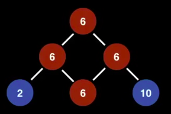
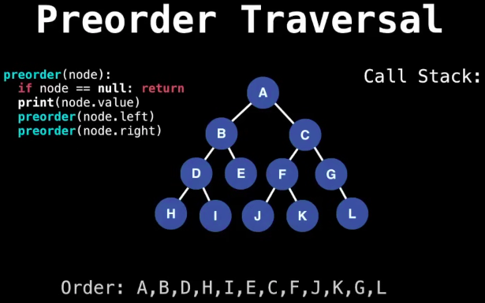

# Tree, Binary Tree (BT) and Binary Search Trees (BST)
## 1. Introduction

- **<heading>Tree DS</heading>**
  - Tree Data Structure is a non-linear data structure in which a collection of elements known as nodes are connected to each other via edges such that there exists exactly one path between any two nodes.
  - It's an **undirected graph** which satisfies any of the following definitions.
    - An acyclic (no cycles) connected graph.
    - A connected graph with $N$ nodes and $N-1$ edges.
    - An graph in which any two vertices are connected by ***exactly*** one path.
  - **Rooted Tree**
    - If we have a roote tree then we want to have a reference to the root node of the Tree.
    - It doesn't always matter that which node is selected to be root node because any node can be root of the tree.
  - **Key terminologies**
    - *Root Node:* 
      - The top-most node of the tree.
    - *Child Nodes:*
      - Each node can have up to two children (left and right).
    - *Leaf Nodes:*
      - Nodes with no children (i.e., both left and right child pointers are null).
    - *Height of the Tree:* 
      - The number of edges on the longest path from the root to a leaf.
    - *Subtrees:*
      - Every node can act as the root of its own binary tree.
  - **Types of Tree DS**
    - *Binary Tree*
    - *Binary Search Tree*
    - *AVL Tree*
    - *Red-Black Tree*
    - *Ternary Search Tree*
    - *n-ary or Generic Tree*
    - *B Tree*
    - *B+ Tree*
    - *Other Type of Trees*
      - *Ternary Tree*
      - *Interval tree*
      - *2-3-4 Tree*

- **<heading>Binary Tree (BT):</heading>**
  - A *Binary Tree* is a *Tree DS* in which every node has at most 2 child nodes meaning we can have BT node having exactly either 1 node or 2 nodes.

  - **Types of Binary Trees:**
    - *Full Binary Tree:* 
      - Each node has either 0 or 2 children.
    - *Complete Binary Tree:* 
      - All levels except possibly the last are fully filled, and the nodes at the last level are as far left as possible.
    - *Perfect Binary Tree:* 
      - All levels are fully filled, and all leaf nodes are at the same depth.
    - *Balanced Binary Tree:* 
      - The height difference between the left and right subtrees of any node is at most 1.
    - *Binary Search Tree (BST):* 
      - A binary tree where the left child of a node contains a value less than the node, and the right child contains a value greater than the node.

- **<heading>Binary Search Tree (BST):</heading>**
  - A *Binary Search Tree* is a *Binary Tree* where each node has at most two(0, 1 or 2) children that satisfies the BST invariant:
    - Left Subtree/node/child has smaller elements/value and
    - Right Substree/node/child has larger elements/value greater than parent node.
  - It is used to store data in sorted manner.
  - This hierarchical structure allows for efficient searching, insertion, and deletion operations on the data stored in the tree.
  - BST elements must be comparable, so that we can order them inside.
  - **Important Points about BST**
    - It's useful for maintaining sorted stream of data. 
    - It allows *search, insert, delete, ceiling, max and min* in $O(h)$ time. Along with these, we can always *traverse the tree items in sorted order*.
    - With *Self Balancing BSTs*, we can ensure that the *height of the BST* is bound be $Log(n)$. Hence we achieve, the above mentioned $O(h)$ operations in $O(Log n)$ time.
    - **Note:** 
      - When we need only *search, insert and delete* and do not need other operations, we *prefer Hash Table over BST* as a Hash Table supports these operations in $O(1)$ time on average.
  - **Examples:**
    <table>
    <tr>
      <td>Not a BST since 9 is larger than 8. <br/>It should be in the right subtree of 8.</td>
      <td>
        
      </td>
      <td>Not a BST or TREE as it contains cycle.</td>
      <td>
        
      </td>
    </tr>
    </table>
  - **BST - Time complexity:**

| Operation |   Average   |  Worst  |
| --------- | ----------- | ------- |
| Insert    | $O(log(n))$ | $O(n)$  |
| Delete    | $O(log(n))$ | $O(n)$  |
| Remove    | $O(log(n))$ | $O(n)$  |
| Search    | $O(log(n))$ | $O(n)$  |
  - **BST - Search/Find Operation:**
    - Here's the 4 situations could arise while searching for the elements:
        - We hit a *null node*, meaning the value doesn't exits in the BST.
        - *Comparator value **equal to $0$***, meaning the value is found.
        - *Comparator value **less than $0$***, meaning the value if it exists, it is in the left subtree.
        - *Comparator value **greater than $0$***, meaning the value if it exists, it is in the right subtree.
  - **BST - Insert Operation:**
    - While inserting new elements compare it's value to the value stored in current node we're considering to decide on one of the following;
      - if value is less, then recurse down left subtree.
      - if value is greater, then recurse down right subtree.
      - if value is equal, handle finding a duplicate value.
      - if reached leaf node (found null), create a new node and add it to tree.
  - **BST - Remove Opertaion:**
    - Removing elements from BST is a two step process.
      - **Find** the element we wish to remove (if it exists).
      - **Replace** the node we want to remove with it's successor (if any) to maintain the BST invariant.
      - Following are the four cases of node, we're trying to remove:
        - It's a leaf node.
        - Has a right subtree but no left subtree.
        - Has a left subtree but no right subtree.
        - Has both left and right subtree.
      - **Removing: Leaf Node:**
        - As there are no subtrees hence no reblalncing is required. Hence we can do it without any overhead and side-effect.
      - **Removing: Either left/right node is a subtree**
        - The successor of the node, we're trying to remove will become the **root node of the left/right subtree**. 
        - It may be the case that we're removing the root node of the BST in which case it's immediate child becomes the new root as you would expect.
      - **Removing: Node with both left subtree and right subtree:**
        - **Question:** In which subtree will the successor of the node we are trying to remove be?
        - **Answer:** The Answer is both! The successor can either be *largest value in the left subtree* or *smallest value in right subtree*.
        - **Justification:**
          - We can choose from any subtree based on our approach.
          - *The largest value in left subtree satisfies the BST invariant*
            - Since, it's larger than everything in left subtree.
            - Is samller than everything in right subtree.
          - *The smallest value in right subtree satisfies the BST invariant*
            - It's smaller than everything in right subtree.
            - It's larger than everything in left subtree.
        - ***Steps:***
          - **Step-1:** *Find the Inorder Successor (or Predecessor):*
            - Typically, the ***inorder successor*** is chosen for replacement.
              - The *inorder **successor*** is the smallest node in the right subtree.
              - The *inorder **predecessor*** is the largest node in the left subtree.
          - **Step-2:** *Replace the Node's Value with the Successor's Value*
            - *Copy the value* of the inorder successor into the node to be deleted.
          - **Step-3:** *Delete the Inorder Successor*
            - Since the inorder successor is the smallest node in the right subtree, it will have at most one child (right child).
            - Remove it as if it were a node with one or zero children.

- **Use cases:**
    - Folder structure (file system) in an operating system.
    - Tag structure in an HTML (root tag the as html tag) or XML document.
    - Binary Search Trees (BST)
      - Implementation of some map and set ADTs
      - Red black Trees
      - AVL Trees
      - Splay Trees ... etc.
    - *Binary Heap* implementation
    - *Syntax trees* - used by compiler and calculators
    - *Treap* - a probablistic DS (uses a randomized BST)
- **<heading>Tree traversal:</heading>**
  - Tree Traversal techniques include various ways to visit all the nodes of the tree. 
    - Unlike linear data structures (Array, Linked List, Queues, Stacks, etc) which have only one logical way to traverse them, trees can be traversed in different ways.
    - ***Depth First Traversal (DFT)***
      - *Inorder Traversal*
      - *Preorder Traversal*
      - *Postorder Traversal*
    - ***Breadth First Traversal (BFT)***
      - *Level Order Traversal*

  - **Preorder Traversal: *(Root, Left, Right)***
    - *Approach:*
      - Print the value of the root/current node
      - Traverse the left subtree *(Recursively)* 
      - Traverse the right subtree *(Revursively)*.
    - **Use cases:**
      - *Copying a Tree (Cloning):*
        - When replicating a tree, we must first create the root, then recursively create left and right subtrees.
        - Pre-order ensures the structure is maintained.
  
      - *Expression Trees (Prefix Notation):*
        - Used in mathematical expression trees to generate prefix notation.
        - Useed in *parsing expressions* in compilers and calculators.
        - For the expression $(A + B) * (C - D)$ --> as $* + A B - C D$ (Prefix notation)

      - *Tree Serialization (Storing and Loading Trees):*
        - ***Serialization:*** Convert a tree into a string (or list) to store in a file.
        - ***Deserialization:*** Reconstruct the tree from the stored data.
        - *Why Preorder:*
          - Ensures that the root is always processed first.
          - Helps in reconstructing the exact tree structure without ambiguity.

      - *File System Traversal:*
        - Used in listing files and folders in a hierarchical directory structure.
        - **Example:** *ls -R* in Linux does a pre-order traversal.
          - *-R:* List subdirectories recursively.

      - *Solving Maze/Graph Problems (DFS):*
        - Depth-First Search (DFS) follows a pre-order traversal approach.
        - Used in:
          - Path finding algorithms (e.g., finding exits in a maze).
          - Solving puzzles (e.g., Sudoku, N-Queens).
          - AI decision trees.

      - *Network Routing (Hierarchical Networks):*
        - Used in hierarchical routing protocols like OSPF (Open Shortest Path First).
        - The root router (core) is processed first, then child routers.

    - *Sudo code - Recursive Algo.:*
    ```python
        def preorder_recursive(root):
          if root:
              print(root.val, end=" ")  # Visit/Process the node
              preorder_recursive(root.left)  # Traverse left
              preorder_recursive(root.right)  # Traverse right
    ```
    - *Sudo code - using Stack:*
    ```python
        def preorder_iterative(root):
          if not root:
              return
          
          stack = [root]
          while stack:
              node = stack.pop()
              print(node.val, end=" ")  # Visit the node
              if node.right:
                  stack.append(node.right)  # Push right child first (LIFO)
              if node.left:
                  stack.append(node.left)  # Push left child last (so it gets processed first)
    ```
<center>
  
</center>

  - **Inorder Traversal: *(Left, Root, Right)***
    - **Approach:**
      - Traverse the left subtree *(Recursively)* 
      - Print the value of the root node  
      - Traverse the right subtree *(Revursively)*.
    - *Note:*
      - Notice that with a *BST* the values printed by *Inorder traversal* are in *increasing order*.
    
    - **Use cases:**
      - *Binary Search Trees (BST) Sorting:*
        - In-order traversal of a BST results in nodes being visited in ascending order.
        - This is incredibly useful when you need to get a sorted list of elements.

      - *Converting a Binary Tree to a Doubly Linked List:*
        - The in-order traversal visits nodes in a “linked list” fashion.
        - Each visited node can be linked to the next, creating a sorted doubly linked list.

      - *K-th Smallest/Largest Element in BST:*
        - In-order traversal is used to find the $k-th$ smallest or largest element efficiently.
        - *Example:*
          - To find the 3rd smallest element, do an in-order traversal and count the nodes until you reach $k$.

      - *Validating a Binary Search Tree (BST):*
        - Checking if a binary tree follows BST properties.
        - An in-order traversal should yield a strictly increasing sequence of values if the tree is a valid BST.
        - ***Example:***
          - For each node during traversal, ensure the current node’s value is greater than the previous node’s value.

      - *Expression Trees (Infix Expression):*
        - Used to print out an expression in human-readable infix form, with proper parentheses for operator precedence.
        - It naturally follows the arithmetic precedence rules.

      - *Database Queries and Indexing:*
        - In databases, trees (like B-trees or AVL trees) are used for indexing.
        - In-order traversal helps in range queries to get sorted data within a range.
        - ***Example:***
          - Retrieve all values between 10 and 20.
        - ***Why In-order?***
          - Processes nodes in sorted order, perfect for ordered range queries.

    - *Sudo code - Recursive Algo.:*
    ```python
        def inorder_recursive(root):
          if root:
              inorder_recursive(root.left)  # Traverse left
              print(root.val, end=" ")  # Visit the node
              inorder_recursive(root.right)  # Traverse right
    ```
    - *Sudo code - using Stack:*
    ```python
        def inorder_iterative(root):
          stack = []
          current = root
          while stack or current:
              while current:  # Go as left as possible
                  stack.append(current)
                  current = current.left
              current = stack.pop()  # Visit the node
              print(current.val, end=" ")
              current = current.right  # Move to right subtree
    ```
<center>
  
</center>

  - **Postorder Traversal: *(Left, Right, Root)***
    - Traverse the Left subtree followed by the right subtree and then print the value of the node.
    - *Approach:*
      - Traverse the left subtree *(Recursively)* 
      - Traverse the right subtree *(Revursively)*.
      - Print the value of the root node.
    - **Note:**
      - It's commonly used for deleting trees, evaluating expressions, and converting trees into postfix notation.
    - **Use cases:**
      - *Deleting a Tree (Memory Cleanup):*
        - Ensures children are deleted before the parent.
        - Ensures safe memory deallocation without orphaning child nodes.
        - This prevents memory leaks and dangling pointers.
      
      - *Expression Tree Evaluation (Postfix Notation):* 
        - Used in compilers and calculators to evaluate mathematical expressions.
        - *Example:* $(3 + 4)$ as $(3 4 +)$.
        - Operators are evaluated only after their operands (e.g., + is processed after 3 and 4 are available).

      - *Dependency Resolution (Task Scheduling, Build Systems):* 
        - Used in task scheduling systems, build dependency graphs, and package managers (e.g., make, Maven, Gradle).
        - Ensures dependencies (modules/components) are processed before the dependent project.

      - *File System Deletion (Recursive Folder Deletion):*
        - Used in deleting directories and file systems where child files are removed before their parent directory.
        - Ensures files are deleted before folders, preventing errors.
      
      - *Tree Balancing (AVL Tree, Red-Black Tree):*
        - Post-order is used to recalculate balance factors in self-balancing trees after insertion/deletion.
        - *Why Post-order?*
          - Ensures subtree heights are updated before checking parent balance.
      - *Reverse Polish Notation (RPN) Evaluation:*
        - Used in stack-based calculations (e.g., Hewlett-Packard calculators).
        - *Example:*
          - Expression: (5 + 3) * 2
            - ✅ Post-order traversal: 5 3 + 2 *
            - ✅ Evaluates as:
              - 5 3 + → 8
              - 8 2 * → 16
    - *Sudo code - Recursive Algo.:*
    ```python
        def post_order_traversal(root):
          if root:
              post_order_traversal(root.left)
              post_order_traversal(root.right)
              print(root.value, end=" ")
    ```
    - *Sudo code - using Stack:*
    ```python
        def post_order_iterative(root):
          if not root:
              return
          
          stack, output = [root], []          
          while stack:
              node = stack.pop()
              output.append(node.value)
              
              if node.left:
                  stack.append(node.left)
              if node.right:
                  stack.append(node.right)
          print(" ".join(map(str, output[::-1])))  # Reverse output for post-order
    ```  
<center>
  
</center>

  - **Level-Order Traversal: *(Breadth-First Search)***
    - Level Order Traversal processes nodes level by level from top to bottom, left to right.
    - This traversal is implemented using a queue (FIFO structure). 
    - Begins with root node inside the queue and finishes when the queue is empty.
    - At each iteration we add the left child and then the right child of current node to our queue.
    - *Approach:*
      - Visit all nodes at ***depth 0*** (root).
      - Visit all nodes at ***depth 1*** (children of root).
      - Visit all nodes at ***depth 2***, and so on.

    - *How It Works (Using a Queue)*
    ```sh 
        1. Start with the root in the queue.
        2. While the queue is not empty:
            Dequeue a node and process it.
            Enqueue its left and right children (if they exist).
        3. Repeat until all nodes are processed.
    ```

    - **Use cases:**
      - *Finding the Shortest Path in an Unweighted Graph:*
        - In graph theory, level order traversal is used in Breadth-First Search (BFS) to find the shortest path.
        - *Example:*
          - Consider a maze or social network where each node is a person and edges represent friendships.
          - Level order traversal can find the shortest path between two people in a network.

      - *Printing a Tree Level-by-Level:*
        - Used in debugging and visualizing hierarchical data.

      - *Finding the Deepest Node:*
        - The last node processed in level order is the deepest node.

      - *Checking If a Tree is Complete:*
        - A complete binary tree has all levels fully filled, except possibly the last.
        - If a node is missing before another node in level order, it’s not complete.

      - *Serializing and Deserializing Trees:*
        - Serialization: Convert a tree into a list/string.
        - Deserialization: Reconstruct a tree from that list
    
    - *Sudo code: implementation*
    ```python
        def level_order_traversal(root):
          if not root:
              return
          
          queue = deque([root])
          while queue:
              node = queue.popleft()
              print(node.value, end=" ")  # Process node
              if node.left:
                  queue.append(node.left)  # Enqueue left child
              if node.right:
                  queue.append(node.right) # Enqueue right child
    ```

  - **Implementations:**
    - ***Binary Search Tree (BST):***
      - [BinarySearchTree.java](https://github.com/SRVivek1/grokking-coding-rounds/blob/main/a1-ds-algo-java/a1-ds-arrays/src/main/java/com/srvivek/dsalgo/binarytree/BinarySearchTree.java)


- **<ins>References:</ins>**
  - [https://youtu.be/RBSGKlAvoiM?t=11100](https://youtu.be/RBSGKlAvoiM?t=11100)
  - [https://www.geeksforgeeks.org/tree-traversals-inorder-preorder-and-postorder/](https://www.geeksforgeeks.org/tree-traversals-inorder-preorder-and-postorder/)
---
<center>
<h1> ------ End ------ </h1>
</center>

<!-- HTML styling -->
<style>
table, th, td {
  border: 1px solid black;
  border-collapse: collapse;
}
heading {
  color: blue;
  font-size: 20px;
  }
</style>