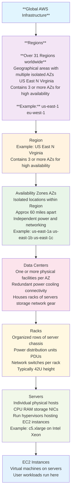

# AWS Infrastucture - Formatting In progress

```mermaid
graph TD
    %% Global AWS Infrastructure Hierarchy

    A[**Global AWS Infrastructure**] 
    
    A --> B[**Regions** <br/>
    **Over 31 Regions worldwide** <br/> Geographical areas with multiple isolated AZs  <br/> US East N Virginia\nContains 3 or more AZs for high availability <br/>
    **Example:** us-east-1 eu-west-1]
    
    B --> C[Region\nExample: US East N Virginia\nContains 3 or more AZs for high availability]
    
    C --> D[Availability Zones AZs\nIsolated locations within Region\nApprox 60 miles apart\nIndependent power and networking\nExample: us-east-1a us-east-1b us-east-1c]
    
    D --> E[Data Centers\nOne or more physical facilities per AZ\nRedundant power cooling connectivity\nHouses racks of servers storage network gear]
    
    E --> F[Racks\nOrganized rows of server chassis\nPower distribution units PDUs\nNetwork switches per rack\nTypically 42U height]
    
    F --> G[Servers\nIndividual physical hosts\nCPU RAM storage NICs\nRun hypervisors hosting EC2 instances\nExample: c5.xlarge on Intel Xeon]
    
    G --> H[EC2 Instances\nVirtual machines on servers\nUser workloads run here]
    
    
    style A fill:#e1f5fe
    style B fill:#f3e5f5
    style C fill:#fff3e0
    style D fill:#e8f5e8
    style E fill:#fce4ec
    style F fill:#fff8e1
    style G fill:#f1f8e9
    style H fill:#e3f2fd
```