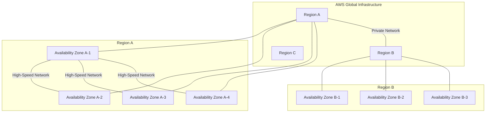

# AWS services: AWS Region Overview

-----

### 1\. Concept Overview
  - From an architect's perspective, an AWS Region is a **physical, isolated geographic area** where AWS clusters its data centers. 
  - Each Region is a completely separate and independent entity. 
  - This foundational concept is the bedrock of AWS's global infrastructure, enabling customers to deploy applications and data with high availability, fault tolerance, and compliance with data residency requirements. 
  - **The primary goal** of Regions is to isolate failures and provide resources close to end-users to minimize latency.

-----

### 2\. Detailed Explanation
  * An AWS Region is a collection of one or more **Availability Zones (AZs)**.
  * Each region has many availability zones ***(usually 3, Minimum 3 and max is 6)***.
    * AZs are named after region name with alphabet suffix.
    * **Examples:** 
      * ***us-east-1*** has 3 Azs - ***us-east-1a, us-east-1b & us-east-1c***. 
  * An **AZ** is one or more discrete data centers with redundant power, networking, and connectivity.
    * This means that an AZ is not a single building, but rather a collection of one or more separate data centers.
    * These data centers are designed with redundant power, networking, and connectivity, which means they have backup systems to ensure continuous operation. 
    * This design is crucial for high availability and fault tolerance.
  * These AZs are physically separated from each other by a meaningful distance (many kilometers) but are interconnected via a high-bandwidth, ultra-low-latency private network. 
    * This design ensures that if a natural disaster or major power outage affects one AZ, the other AZs in the same Region remain unaffected.


#### Key Concepts

* **Discrete Data Centers**: 
  * This means the data centers that make up an AZ are physically separate from one another. This physical separation helps protect against failures caused by events like fires, floods, or natural disasters that could affect a single location.
* **Redundant Power**: 
  * Each data center has multiple, independent power sources and backup systems (like generators) to prevent power outages from affecting services.
* **Redundant Networking**: 
  * The network infrastructure within an AZ is designed with multiple paths and devices to ensure that if one component fails, traffic can be rerouted to maintain connectivity.
* **Redundant Connectivity**: 
  * AZs are interconnected with other AZs in the same AWS Region via high-speed, low-latency private fiber optic networks. This allows for synchronous replication of data between AZs, which is essential for services like databases that require high availability.

#### Why It Matters

  * The design of AZs as "one or more discrete data centers" is fundamental to AWS's high-availability architecture. 
  * By deploying applications across multiple AZs within a single AWS Region, customers can protect their applications from failures in a single data center. If one AZ experiences an outage, the application can continue to run in the other AZs, ensuring business continuity. 
  * This concept of using multiple AZs for fault tolerance is a core principle of designing resilient applications on AWS.


#### Why use Regions?

  * **Latency:** 
    * Deploying applications in a Region geographically closer to your end-users drastically reduces network latency, providing a better user experience.
  * **Data Sovereignty and Compliance:** 
    * Many countries and industries have regulations (e.g., GDPR in Europe, HIPAA in the US) that require data to reside within specific national or regional borders. Selecting the correct AWS Region ensures compliance.
  * **Fault Tolerance & Disaster Recovery:** 
    * By deploying your application across multiple Regions (a multi-region strategy), you can protect against a rare, but catastrophic, failure of an entire Region. 
    * This is a key part of a robust disaster recovery plan.

  * **Note:** 
    * Each AWS Region has a unique code, such as ***us-east-1*** (N. Virginia), ***eu-west-2*** (London), or ***ap-south-1*** (Mumbai). 
    * This code is used in the AWS CLI, SDKs, and console to specify where you want to create your resources.

-----

### AWS Points of Presence (Edge Locltions)

  * More commonly known as **Edge Locations**, are a key part of AWS's global network infrastructure. 
    * Amazon has 400+ Points Of Presence (400+ Edge Locations & 10+ regional caches) in 90+ cities cross 40+ cities.
  * They are a worldwide network of data centers strategically placed in major metropolitan areas to be as close as possible to end users.

  * Unlike AWS Regions and Availability Zones, which host core services like EC2 and S3, Edge Locations are primarily designed for one purpose:
    * To **reduce latency** and speed up content delivery. 
    * They achieve this by ***caching frequently accessed content***, such as static files (images, videos, CSS, and JavaScript), closer to the user.

#### How They Work

  * Content is delivered to end user with lower latency (Lowest latency possible).
  * When a user requests content that is served through a service like **Amazon CloudFront** *(AWS's Content Delivery Network)*, the request is automatically routed to the nearest Edge Location.

    * **Check Cache**: 
      * The Edge Location first checks if it has a cached copy of the requested content.
    
    * **Serve from Cache**: 
      * If the content is in the cache, it's served directly to the user. This is extremely fast because the data has very little distance to travel.
    
    * **Fetch from Origin**: 
      * If the content is not in the cache, the Edge Location retrieves it from the origin server (e.g., an S3 bucket or an EC2 instance in an AWS Region). 
      * It then delivers the content to the user and stores a copy in its cache for future requests.

#### Key Services that Use Edge Locations

  * Edge Locations are essential for several AWS services that require low latency and high performance:

    * **Amazon CloudFront**: 
      * This is the primary service that uses Edge Locations as a CDN to cache and deliver content globally.

    * **AWS Global Accelerator**: 
      * This service improves the availability and performance of applications by directing user traffic to the optimal AWS endpoint over the AWS global network backbone, bypassing the public internet.

    * **Amazon Route 53**: 
      * As a managed DNS service, Route 53 uses Edge Locations to provide fast DNS resolution, directing users to the closest available resource.

    * **AWS WAF & AWS Shield**: 
      * These security services also operate at the Edge Locations, inspecting traffic and providing protection against threats like DDoS attacks before they reach your main application servers.

  * In short, while Regions and AZs are where you build your core application, Edge Locations are how you get your content to your users quickly and securely, no matter where they are in the world. 

  * Here is an explanation of the AWS Global Infrastructure, including Edge Locations and CloudFront. 
    * [AWS Global Infrastructure: Understanding Edge Locations and CloudFront](https://www.youtube.com/watch?v=9eS9XPhPsdU)


-----

### 3\. Code Examples

While a Region isn't a code concept itself, but we specify it when interacting with AWS services programmatically.

  * **Using the AWS CLI:**
    * You can specify the region using the ***--region*** flag.

```bash
# Create an S3 bucket in the eu-central-1 (Frankfurt) region
aws s3api create-bucket 
    --bucket my-bucket-2025 
    --region eu-central-1 
    --create-bucket-configuration LocationConstraint=eu-central-1
```

<br/>

  * **Using the AWS Java SDK:**
    * You can configure the client to use a specific region.

```java
import software.amazon.awssdk.regions.Region;
import software.amazon.awssdk.services.s3.S3Client;

public class S3Example {
    public static void main(String[] args) {
        // Create an S3 client for the US East (N. Virginia) region
        S3Client s3 = S3Client.builder()
                .region(Region.US_EAST_1)
                .build();
        
        // Example: List buckets in that region
        s3.listBuckets().buckets().forEach(bucket -> 
            System.out.println(bucket.name()));
    }
}
``` 

-----

### 4\. Diagrams

The relationship between a Region and its Availability Zones can be visualized as a hierarchical structure.



-----

-----

### 5\. Real-World Applications

  * **Global SaaS Application:** 
    * A company offering a global SaaS product would deploy its application in multiple Regions (e.g., ***us-east-1*** for North America, ***eu-central-1*** for Europe, ***ap-northeast-1*** for Asia) to ensure low latency for all users and provide multi-region disaster recovery.
  * **Financial Services:** 
    * A bank handling customer data in Germany must comply with local laws and deploy its applications and databases in the ***eu-central-1*** (Frankfurt) Region to guarantee data residency.
  * **Media and Gaming:** 
    * Online gaming platforms or streaming services need to deliver content with the lowest possible latency. 
    * They deploy their services in the Region closest to their largest user base, often supplemented by ***AWS's Edge Locations*** for caching.

-----

### 6\. Advantages & Drawbacks

**Advantages:**

  * **Geographic Isolation:** 
    * Provides a high degree of fault isolation. A failure in one Region does not impact another.
  * **Low Latency:** 
    * Allows you to place resources close to your customers.
  * **Compliance:** 
    * Helps meet data residency and regulatory requirements.
  * **Service Diversity:** 
    * Newer services are often released in a few Regions first. 
    * Choosing a Region like ***us-east-1*** (N. Virginia) or ***us-west-2*** (Oregon) often gives you early access to new features.

**Drawbacks:**

  * **Data Transfer Costs:** 
    * Data transfer between Regions (***inter-region***) is more expensive than within a single Region.
  * **Management Complexity:** 
    * A multi-region architecture requires careful planning for data synchronization, consistency, and failover, which adds complexity.
  * **Service Discrepancies:** 
    * Not all services are available in every Region, and service pricing can vary.

-----

### 7\. Trade-offs

  * **Single-Region vs. Multi-Region:** 
    * **A single-region deployment** is simpler and more cost-effective for applications that don't have strict latency or disaster recovery requirements. 
    * **A multi-region strategy** is a trade-off of increased complexity and cost for higher availability and fault tolerance, suitable for mission-critical applications.
  * **Latency vs. Cost:** 
    * Choosing a cheaper Region that is far from your users might save on compute costs but increase latency and, potentially, data transfer costs, leading to a poor user experience.

-----

### 8\. How to Choose an AWS Region

Choosing the right AWS Region for your services is a critical decision that depends on several factors. Here's a breakdown of the key considerations:


#### 1\. Data Governance and Legal Compliance

  * The most important factor is often **data residency**.
  * AWS ensures that your data stays within the selected region unless you explicitly move it. 
  * This is crucial for complying with local laws and regulations, such as the General Data Protection Regulation (GDPR) in Europe, which dictate where certain types of data must be stored.


#### 2\. Proximity to End Users

  * To provide the best user experience, you should choose a region that's geographically close to your primary audience. A shorter distance means less network latency, resulting in faster load times and a more responsive application. 


#### 3\. Service Availability

  * Not all AWS services are available in every region. Newer services and features are often launched in a few key regions first. Before you choose a region, check the AWS Regional Services List to ensure all the services you plan to use are available there.


#### 4\. Cost

  * Pricing for AWS services can vary significantly from one region to another. Factors like local power costs, taxes, and infrastructure expenses contribute to these differences. It's wise to check the pricing page for the services you need in the regions you are considering to find the most cost-effective option.

-----

### 9\. Best Practices

  * **Default Region:** 
    * Set a default Region in your account, but always be explicit about the Region for each resource you create, especially in automation scripts.
  * **Use Multi-AZ, Not Multi-Region (for most cases):** 
    * For high availability, a ***multi-AZ deployment*** within a single Region is often sufficient and more cost-effective. 
    * Reserve multi-region for disaster recovery.
  * **Plan for Latency and Data Transfer:** 
    * Use services like ***Amazon Route 53*** and ***Global Accelerator*** to route users to the nearest Region and minimize latency. 
    * Architect your application to reduce inter-region data transfer.

-----

### 10\. Interview Angle

**Possible Questions:**

  1. Explain the difference between an AWS Region and an Availability Zone.
  2. Why would you choose to deploy your application in a specific AWS Region?
  3. What are the key considerations for a multi-region deployment strategy?
  4. How does a multi-region architecture improve fault tolerance and disaster recovery?

**How to Answer Confidently:**

  * Start with a clear, concise definition - "An AWS Region is a geographical area, while an Availability Zone is a cluster of data centers within that Region."
  * Frame your answers around business drivers: compliance, latency, and disaster recovery.
  * Demonstrate a practical understanding by mentioning specific services and how they are used in a multi-region context (e.g., Route 53 for DNS, cross-region replication for S3).
  * Acknowledge the trade-offs. Show that you understand the balance between availability, cost, and complexity.

-----

### 11\. Online References

  * [AWS Global Infrastructure](https://aws.amazon.com/about-aws/global-infrastructure/)
  * [AWS Regions and Availability Zones - Official Docs](https://docs.aws.amazon.com/AWSEC2/latest/UserGuide/using-regions-availability-zones.html)
  * [AWS Fault Isolation Boundaries Whitepaper](https://www.google.com/search?q=https://d1.awsstatic.com/whitepapers/aws-fault-isolation-boundaries.pdf)

-----

### 12\. Summary

  * An **AWS Region** is a distinct geographic area containing multiple, isolated **Availability Zones (AZs)**. This architecture is designed for maximum fault tolerance, low latency, and data residency compliance.
  * Choosing the right Region is a critical architectural decision based on your target audience's location, regulatory requirements, and desired level of resilience.

-----

### 13\. Extra Insights

**Mnemonics:**

  * **R**egion: 
    * Think of **R**egions as **R**eal-world **R**egions (countries).
  * **A**vailability **Z**one: 
    * Think of **A**Zs as **A**djacent, but **A**utomatically **A**part data centers.

**Mind Map:**

  * **AWS Regions**
      * **What is it?**
          * Geographic Area
          * Contains multiple AZs
          * Isolated from other Regions
      * **Why use it?**
          * Latency
          * Compliance (Data Sovereignty)
          * Disaster Recovery
      * **Key Services**
          * **Regional:** EC2, S3, RDS
          * **Global:** IAM, Route 53, CloudFront
      * **Decision Factors**
          * Cost
          * Service Availability
          * User Location

-----

### 14\. For AWS Certification Exam Perspective

**Key Points:**

  * **Regions vs. AZs:** 
    * A Region is a physical location, and an AZ is a data center within a Region. This is a common foundational question.
  * **Fault Isolation:** 
    * AWS Regions are isolated from each other. 
    * A failure in one Region will not impact services in another. 
    * This is the primary reason for multi-region deployments for business continuity.
  * **Regional Services vs. Global Services:** 
    * Be able to differentiate between services.
      * **Regional Services:** 
        * Most services (EC2, S3, RDS, Lambda, VPC) are tied to a specific Region.
        * Which means that their resources only exist within that Region.
      * **Global Services:** 
        * A few services (IAM, Route 53, CloudFront, AWS WAF) are global. 
        * Resources created in these services are not tied to a specific Region but are available worldwide. 
        * For example, an IAM user created in one account is accessible in all Regions for that account.
  * **Latency:** 
    * Understand that placing resources closer to end-users reduces latency. 
    * This is a key benefit of using multiple Regions or a single Region with Edge Locations (CloudFront).
  * **Data Transfer Costs:** 
    * Remember that data transfer costs are higher for inter-region traffic. 
    * The exam may ask scenario questions where you need to consider this cost.
  * **Multi-AZ vs. Multi-Region:** 
    * For high availability, 
      * **Multi-AZ** is the standard and more cost-effective approach. 
      * **Multi-Region** is for disaster recovery and extreme fault tolerance.
  * **Opt-In Regions:** 
    * Some newer Regions are "opt-in" and ***must be explicitly enabled*** in your account before you can use them.


---

<ul class="flex-list">
    <li>
        <a href="https://srvivek1.github.io/">Go to Home</a>
    </li>
    <li><a href="https://github.com/SRVivek1/">Author: Vivek K Singh</a></li>
</ul>

<center>
<p> ------ </p>
</center>

<!-- HTML styling -->
<style>
table, th, td {
  border: 1px solid black;
  border-collapse: collapse;
}
heading {
  color: blue;
  font-size: 20px;
}

.flex-list {
    display: flex; /* Makes the <ul> a flex container */
    list-style-type: none;
    margin: 0;
    padding: 0;
    justify-content: space-between;
}

.flex-list li {
    /* No display change needed, flex items are already inline */
    margin-right: 20px;
}

</style>