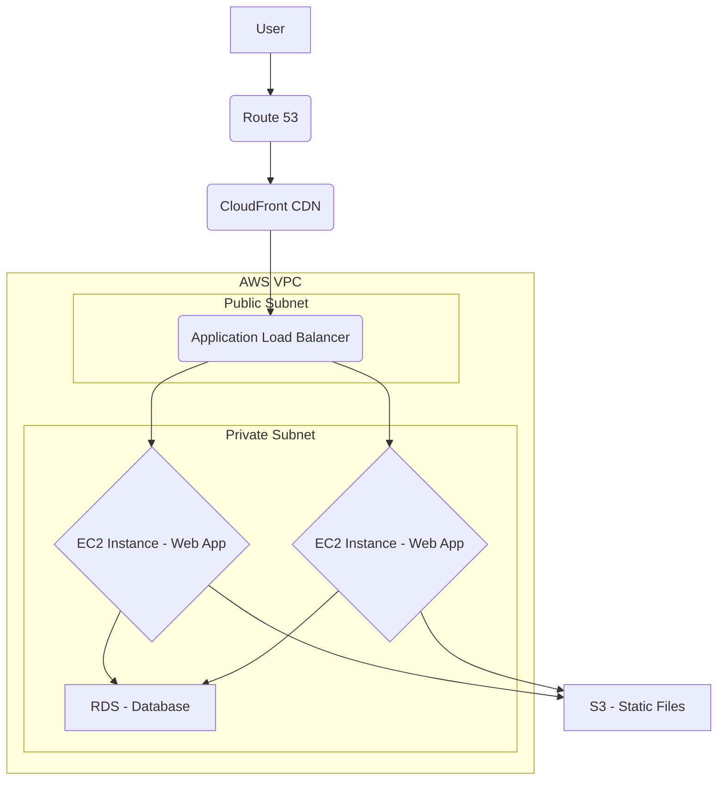
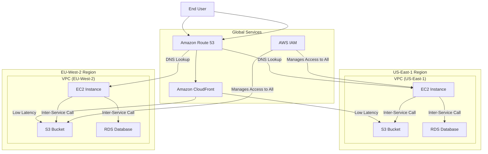

# AWS : AWS Services Overview

-----


### Concept Overview

  * Amazon Web Services (AWS) is a comprehensive, on-demand cloud computing platform that offers a wide range of services. 
  * From an architect's perspective, AWS provides the fundamental building blocks to design, deploy, and manage scalable, reliable, and secure applications. 
    * Instead of owning and maintaining physical data centers and servers, architects leverage these services to build complex systems, focusing on business logic and innovation rather than infrastructure management.
  * **Regional Services:** These services are deployed within a specific AWS Region (e.g., `us-east-1`, `eu-west-2`). Resources created within a regional service, such as an Amazon EC2 instance or an Amazon S3 bucket, are tied to that region and do not automatically replicate to other regions. This is the default and most common type of AWS service.
  * **Global Services:** These services are not tied to a specific AWS Region and are accessible from a global endpoint. They are designed to provide a consistent, unified experience across the entire AWS infrastructure, regardless of the user's or resource's location.

-----

### Detailed Explanation

  * AWS services can be broadly categorized based on their function. This categorization helps in understanding the immense scope of the platform and selecting the right services for a given task. 
  * The main categories reflect the core components of any IT infrastructure: ***compute, storage, databases, networking, and security, with additional categories for modern application development and specialized workloads***.

<br/>

| Category | Description | Key Services |
| :------- | :---------- | :----------- |
| **Compute** | Provides the processing power needed to run applications and code. This is where your application's logic executes. | **Amazon EC2** (Elastic Compute Cloud), **AWS Lambda**, **AWS Elastic Beanstalk**, **Amazon ECS/EKS** |
| **Storage** | Offers different types of storage solutions for various data needs, including objects, files, and blocks. | **Amazon S3** (Simple Storage Service), **Amazon EBS** (Elastic Block Store), **Amazon EFS** (Elastic File System), **Amazon S3 Glacier** |
| **Databases** | Provides managed database services, both relational and non-relational, to store and manage application data. | **Amazon RDS** (Relational Database Service), **Amazon DynamoDB**, **Amazon Aurora**, **Amazon Redshift** |
| **Networking & Content Delivery** | Manages network connectivity, traffic routing, and content distribution to users globally. | **Amazon VPC** (Virtual Private Cloud), **Amazon Route 53**, **Amazon CloudFront**, **Elastic Load Balancing (ELB)** |
| **Security, Identity, & Compliance** | Secures access to AWS resources and applications, ensuring data protection and compliance with regulations. | **AWS IAM** (Identity and Access Management), **AWS WAF**, **AWS Shield**, **AWS KMS** (Key Management Service) |
| **Management & Governance** | Helps you monitor, manage, and govern your AWS environment, ensuring operational efficiency and cost control. | **Amazon CloudWatch**, **AWS CloudFormation**, **AWS Config**, **AWS Systems Manager** |
| **Application Integration** | Facilitates communication between different components of a distributed application, promoting a decoupled architecture. | **Amazon SQS** (Simple Queue Service), **Amazon SNS** (Simple Notification Service), **AWS Step Functions** |
| **Developer Tools** | Provides services for CI/CD (Continuous Integration/Continuous Delivery) pipelines to automate software development workflows. | **AWS CodeCommit**, **AWS CodePipeline**, **AWS CodeBuild**, **AWS CodeDeploy** |
| **Analytics & AI/ML** | Offers services for data processing, real-time analytics, and building and deploying machine learning models. | **Amazon SageMaker**, **Amazon Kinesis**, **Amazon Athena**, **Amazon QuickSight** |

-----

### Code Examples (Java/Spring/Microservices)

Let's imagine a microservice that processes orders. We'll use a few services from different categories to illustrate.

```java
// Spring Boot application using AWS SDK for S3 and SQS
@SpringBootApplication
public class OrderProcessorApplication {

    private final AmazonS3 s3Client;
    private final AmazonSQS sqsClient;

    @Autowired
    public OrderProcessorApplication(AmazonS3 s3Client, AmazonSQS sqsClient) {
        this.s3Client = s3Client;
        this.sqsClient = sqsClient;
    }

    public void processOrder(Order order) {
        // 1. Store order details as an object in S3 (Storage)
        String s3BucketName = "my-order-bucket";
        String s3Key = "orders/" + order.getOrderId() + ".json";
        String orderJson = new Gson().toJson(order);
        s3Client.putObject(s3BucketName, s3Key, orderJson);

        // 2. Send a message to SQS queue for further processing (Application Integration)
        String sqsQueueUrl = "https://sqs.us-east-1.amazonaws.com/123456789012/order-processing-queue";
        SendMessageRequest sendMsgRequest = new SendMessageRequest()
                .withQueueUrl(sqsQueueUrl)
                .withMessageBody(order.getOrderId());
        sqsClient.sendMessage(sendMsgRequest);
    }
}

// In a separate microservice (e.g., a Lambda function)
public class SQSMessageConsumer implements RequestHandler<SQSEvent, Void> {
    public Void handleRequest(SQSEvent event, Context context) {
        for (SQSMessage message : event.getRecords()) {
            String orderId = message.getBody();
            // 3. Process the order, e.g., update a DynamoDB table
            // (Database, not shown for brevity)
            System.out.println("Processing order: " + orderId);
        }
        return null;
    }
}
```

-----

### Single Region architecture

Here's a simple diagram illustrating a basic web application architecture using different AWS service categories.



<br/>

### Multi Region architecture




-----

### Real-World Applications

  * **E-commerce Platform:** 
    * An e-commerce site uses EC2 instances for the front-end, RDS for product data, S3 for product images, and SQS for decoupled order processing.
  * **Media Streaming Service:** 
    * A service like Netflix uses S3 for video storage, CloudFront for global content delivery, and DynamoDB for real-time user data and personalization.
  * **Big Data Analytics:** 
    * A financial firm uses Kinesis to ingest real-time stock data, S3 to store it in a data lake, and Amazon Redshift for complex analytics and reporting.

-----

### Advantages & Drawbacks

**Advantages:**

  * **Scalability & Elasticity:** 
    * Services can scale up or down automatically based on demand, reducing the need for manual capacity planning.
  * **Cost-Effectiveness:** 
    * The pay-as-you-go model eliminates large upfront capital expenditures.
  * **Global Reach:** 
    * AWS's global infrastructure allows for deploying applications closer to users, reducing latency.
  * **Rich Ecosystem:** 
    * A massive number of services and integrations simplifies building complex solutions.

<br/>

**Drawbacks:**

  * **Complexity:** 
    * The sheer number of services can be overwhelming for newcomers.
  * **Vendor Lock-in:** 
    * It can be difficult and costly to migrate away from AWS once deeply integrated.
  * **Cost Management:** 
    * Without proper monitoring, costs can easily spiral out of control due to usage-based pricing.

-----

### Trade-offs

  * **EC2 vs. Lambda:** 
    * Use **EC2** for long-running, stateful applications that require fine-grained control over the underlying server. 
    * Use **Lambda** for short-lived, event-driven, stateless functions, trading control for simplified management and a pay-per-invocation cost model.
  * **RDS vs. DynamoDB:** 
    * Choose **RDS** for applications requiring a fixed schema, complex joins, and strong transactional integrity (ACID properties). 
    * Use **DynamoDB** for high-performance, flexible-schema workloads that need massive scalability and low-latency key-value or document access.

-----

### Best Practices

1.  **Use Infrastructure as Code (IaC):** Use tools like **AWS CloudFormation** or **Terraform** to define your infrastructure, making it repeatable and version-controlled.
2.  **Follow the Principle of Least Privilege:** Use **IAM** to grant only the necessary permissions to users and services.
3.  **Monitor Everything:** Use **CloudWatch** to set up alarms and dashboards to proactively monitor the health and performance of your applications.
4.  **Embrace Serverless:** Where possible, leverage services like Lambda, S3, and DynamoDB to reduce operational overhead.
5.  **Cost Optimization:** Regularly review your spending using **AWS Cost Explorer** and implement cost-saving measures like Reserved Instances or Savings Plans.

-----

### Interview Angle

  * **"Explain the core categories of AWS services."** 
    * Start with the fundamental triad: Compute, Storage, and Networking. 
    * Then, expand on how other categories like Databases, Security, and Application Integration support and enhance the core services to build a complete solution.
  * **"When would you choose EC2 over Lambda?"** 
    * Talk about workload characteristics: long-running processes, stateful applications, or specific OS/software dependencies that aren't well-suited for a serverless model. 
    * Mention cost as a factor, where a constant workload might be cheaper on a Reserved EC2 instance.
  * **"How do you ensure security in an AWS environment?"** 
    * Discuss the shared responsibility model. 
    * Explain key services like IAM for access control, VPC for network isolation, and AWS WAF/Shield for protection against common attacks. 
    * Highlight the importance of encryption for data at rest (e.g., S3, EBS) and in transit (SSL/TLS).

-----

### Online References

  * [AWS Official Documentation](https://aws.amazon.com/documentation/)
  * [AWS Well-Architected Framework](https://aws.amazon.com/architecture/well-architected/)
  * [AWS Global Infrastructure](https://aws.amazon.com/about-aws/global-infrastructure/regional-product-services/)


-----

### Summary

AWS services are the building blocks of modern cloud architecture. They are organized into logical categories—Compute, Storage, Databases, Networking, and more—to provide all the necessary components for building scalable, resilient, and cost-effective applications. Understanding these categories and the key services within them is crucial for any cloud architect.

-----

### Extra Insights

  * **Analogy:** Think of AWS as a massive, well-stocked hardware store. You don't buy the entire store; you rent the specific tools (services) you need for your project (application). The Compute aisle has tools to run things (EC2, Lambda). The Storage aisle holds various boxes and shelves for your data (S3, EBS). The Plumbing aisle connects everything (VPC, Route 53). And the Security office (IAM) gives out the keys to different parts of the store.
  * **Mind Map:** You can visualize the categories with **Compute** in the center, surrounded by **Storage**, **Databases**, and **Networking**. Branching off from these are services like S3 under Storage or EC2 under Compute. The "outer ring" can include **Security** and **Management** services that interact with everything.

-----

### For AWS Certification Exam Perspective

  * **AWS Certified Solutions Architect - Associate:** 
    * Focus on the core services and their interconnections. Know the use cases for EC2, S3, RDS, DynamoDB, VPC, SQS, SNS, and IAM. Understand the shared responsibility model and the AWS Well-Architected Framework.
      * **Key Notes:**
        * **Shared Responsibility Model:** AWS is responsible for "security *of* the cloud" (physical infrastructure), and the customer is responsible for "security *in* the cloud" (data, OS, configurations).
        * **High Availability:** Know how to use services like Elastic Load Balancing, Auto Scaling Groups, and Multi-AZ deployments for resilience.
        * **Cost Management:** Remember that pay-as-you-go, Reserved Instances, and Savings Plans are key cost optimization strategies.
        * **Statelessness:** Understand why designing stateless applications is a best practice for scalability in the cloud.
    * This is a heavily tested topic. Be prepared to identify which services are global and which are regional. You will likely see scenario-based questions that test your understanding of how to use these services together to build a multi-region, highly available, and fault-tolerant architecture.
      * **Key Notes:**
        * **IAM, Route 53, CloudFront, and WAF** are the most commonly cited global services.
        * **S3** is a global service from a management perspective (bucket names are globally unique), but the data itself is stored in a specific region, making it a regional resource. This is a common trick question.
        * Most services are **regional** and should be the default choice unless a global function is explicitly needed.
        * When designing for multi-region disaster recovery, you use **regional services** in a second region and use **global services** (like Route 53) to manage the failover.


---

<ul class="flex-list">
    <li>
        <a href="https://srvivek1.github.io/">Go to Home</a>
    </li>
    <li><a href="https://github.com/SRVivek1/">Author: Vivek K Singh</a></li>
</ul>

<center>
<p> ------ </p>
</center>

<!-- HTML styling -->
<style>
table, th, td {
  border: 1px solid black;
  border-collapse: collapse;
}
heading {
  color: blue;
  font-size: 20px;
}

.flex-list {
    display: flex; /* Makes the <ul> a flex container */
    list-style-type: none;
    margin: 0;
    padding: 0;
    justify-content: space-between;
}

.flex-list li {
    /* No display change needed, flex items are already inline */
    margin-right: 20px;
}

</style>