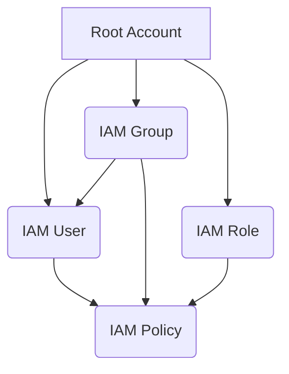

# AWS : AWS User, Groups and Policies

-----

### 1\. Concept Overview

  * **AWS Identity and Access Management (IAM)** is a fundamental and free-to-use ***AWS Global service*** that enables you to securely control access to your AWS resources.
  * From an architect's perspective, IAM is the **security cornerstone** of your cloud environment. 
    * It's about answering the critical questions of **"who can do what and under what conditions?"** within your AWS account. 
    * It enforces the principle of **least privilege**, ensuring that identities (users, applications, services) only have the permissions they absolutely need to perform their tasks, thereby minimizing the attack surface.


-----


### 2\. Detailed Explanation

  * IAM is built on three core pillars: **Identities**, **Policies**, and **Permissions**.

    * **Identities:** 
      * These are the entities that can be authenticated and authorized.
      * **IAM Users:** 
        * These represent a single person within organization and can be grouped. 
        * They have long-term credentials like a username and password for console access, or access keys for programmatic access.
        * Users dpn't have to belong to a group, and also a iser can belon to multiple groups.
        * Root account is created by default, shouldn't be used or shared.
      * **IAM Groups:** 
        * A collection of IAM users. 
        * Groups only contain users and not other groups.
        * Permissions are attached to a group, and all users in that group inherit those permissions. 
          * This simplifies management, as you don't have to manage permissions for each user individually. 
          * For example, you can have a "Developers" group with read-only access to a production database.
      * **IAM Roles:** 
        * Some AWS services will need to perform actions on your behalf, to do dso, we will assign permissions to AWS services with IAM roles.
        * An identity with permissions that can be "assumed" by an entity (a user, a service like an EC2 instance, or another AWS account) to gain temporary access. 
        * Roles do not have long-term credentials. 
        * They are crucial for implementing the principle of least privilege, especially for service-to-service communication.
        * **Some common roles:**
          * EC2 Instance Roles
          * Lambda Function Roles
          * Roles for CloudFormation

    * **Policies:** 
      * These are JSON documents that define permissions. They are the "what" in "who can do what."
      * These policies define the permissions of the users and can be assigned to Users or Groups definining their access.
      * A policy statement includes:
        * **Effect:** 
          * `Allow` or `Deny`. 
          * The `Deny` effect always overrides an `Allow` effect.
        * **Action:** 
          * The specific AWS service API calls that are allowed or denied (e.g., `s3:GetObject`, `ec2:RunInstances`).
        * **Resource:** 
          * The specific AWS resource to which the action applies (e.g., a specific S3 bucket or an EC2 instance ARN).
        * **Principal:** 
          * The user, role, or service that the policy applies to. (This is primarily used in resource-based policies).
  
    * **Permissions:** 
      * The combination of an identity and a policy, which grants the identity the ability to perform certain actions on specific resources.
      * In AWS you apply the ***Least Privilege Principle***, that is don't give more permissions than a user needs.

-----

### **IAM Password Policy:**
* An IAM (Identity and Access Management) password policy is a set of rules that an administrator can define to enforce specific password requirements for users within an AWS account. 
* The primary goal is to enhance the security of user passwords and protect AWS resources from unauthorized access. 
* A strong password policy is a key component of a robust security posture, as it helps mitigate risks from common attacks like credential stuffing and brute-force guessing.


#### Key Elements of an IAM Password Policy

An IAM password policy includes several configurable settings that dictate password strength and management:

* **Minimum Password Length**: 
  * Specifies the minimum number of characters a password must have. A longer password is generally more secure. 
  * The CIS (Center for Internet Security) recommends at least 14 characters.
* **Password Complexity**: 
  * Requires passwords to include a mix of character types, such as uppercase letters, lowercase letters, numbers, and non-alphanumeric characters (symbols).
* **Password Expiration**: 
  * Forces users to change their passwords after a specified period (e.g., every 90 days). 
  * This reduces the risk of a compromised password being used indefinitely.
* **Password Reuse Prevention**: 
  * Prevents users from reusing a certain number of their previous passwords, which helps ensure that new passwords are unique and not easily predictable.
* **User Password Changes**: 
  * Determines whether IAM users are allowed to change their own passwords. 
  * It's considered a best practice to enable this so users can manage their own credentials, but it should be paired with a strong policy.

<br/>

### How to Configure an IAM Password Policy

You can configure an IAM password policy through the AWS Management Console, the AWS Command Line Interface (CLI), or by using infrastructure as code (IaC) tools like AWS CloudFormation.

1.  **Navigate to the IAM Dashboard**: From the AWS Management Console, open the IAM service.
2.  **Access Account Settings**: In the navigation pane, select "Account settings."
3.  **Edit the Password Policy**: In the "Password policy" section, you can edit the settings to align with your organization's security requirements.
    
4.  **Save Changes**: After configuring the desired settings, you save the changes, and the new policy is immediately enforced for all IAM users in the account. For existing users, the policy will be applied on their next password change or if their current password does not meet the new requirements.

It's important to note that an IAM password policy applies to all users in an AWS account and cannot be set on a per-user or per-group basis. For enhanced security, a password policy should be used in conjunction with other security measures, such as **Multi-Factor Authentication (MFA)**, which adds an extra layer of protection by requiring a second form of identity verification.

This video provides a great walkthrough of how to set up an IAM password policy and explains the different rules you can configure.


-----
### Multi-Factor Authentication (MFA) 

* Multi-Factor Authentication (MFA) on AWS is a security best practice that adds an extra layer of protection to your account by requiring a second authentication factor in addition to a username and password. This "something you have" component is crucial because even if an attacker steals your password, they can't access your AWS resources without the MFA device. 

#### Supported MFA Devices

AWS supports several types of MFA devices, allowing you to choose the option that best fits your security and operational needs.

##### Virtual MFA Devices

Virtual MFA devices are applications that run on your smartphone or computer and generate a time-based one-time password (TOTP). This is a widely used and convenient option. Popular authenticator apps that work with AWS include:

* Google Authenticator
* Microsoft Authenticator
* Authy

These apps can manage multiple tokens on a single device, making them a flexible choice for users with multiple accounts.

##### Security Keys (FIDO)

FIDO (Fast IDentity Online) security keys are physical hardware devices that provide strong, phishing-resistant authentication using public key cryptography. These keys typically connect to your computer via USB, NFC, or Bluetooth. They require a physical action, like pressing a button on the key, to complete the authentication. Examples include:

* YubiKey
* Other FIDO-certified products

##### Hardware TOTP Tokens

These are dedicated physical devices, often in the form of a key fob, that have a small screen and generate a new one-time password every few seconds. These are sometimes preferred for high-security accounts or when a smartphone is not a viable option.

You can enable MFA for both the AWS account root user and individual IAM users. It's considered a critical security practice to enable MFA on the root user account and to enforce its use for all privileged IAM users.

This video provides a step-by-step guide on how to enable Multi-Factor Authentication for a user in AWS IAM.


-----

### 3\. Code Examples

* Policies are written in JSON. 
* Here's a simple example of a policy that grants a user read-only access to an S3 bucket named `my-important-data-bucket`:

```json
{
  "Version": "2012-10-17",
  "Statement": [
    {
      "Effect": "Allow",
      "Action": [
        "s3:Get*",
        "s3:List*"
      ],
      "Resource": "arn:aws:s3:::my-important-data-bucket/*"
    }
  ]
}
```

This policy can be attached to an IAM user, a group, or a role.

### 4\. Diagrams

**IAM Relationship Diagram **



**Description:** The root account is the top-level entity. You create IAM users, groups, and roles within it. You attach IAM policies to users, groups, and roles to define their permissions. Users can be members of one or more groups, inheriting all the policies attached to those groups. A role is a separate entity that can be assumed by a user or an AWS service.

### 5\. Real-World Applications

  * **Microservices:** An EC2 instance running a microservice needs to access a DynamoDB table. Instead of hardcoding access keys in the application, you create an IAM role with `dynamodb:Read` permissions and attach it to the EC2 instance. The instance automatically gets temporary credentials, which is far more secure.
  * **CI/CD Pipelines:** A Jenkins server (running on an EC2 instance) needs to deploy new code to an S3 bucket and run a Lambda function. You create an IAM role for the Jenkins EC2 instance with permissions to `s3:PutObject` and `lambda:InvokeFunction`.
  * **Enterprise Management:** You have a large organization with different teams (Dev, QA, Ops). You create IAM groups for each team. The "Dev" group has permissions to develop and deploy in a "dev" environment, while the "Ops" group has permissions for managing production resources. This scales much better than managing individual user permissions.

### 6\. Advantages & Drawbacks

  * **Advantages:**
      * **Fine-grained control:** You can grant very specific permissions, following the principle of least privilege.
      * **Increased security:** Eliminates the need for long-term shared credentials and provides a secure way to manage access for human users and automated processes.
      * **Scalability:** Managing permissions for groups of users is much easier than for individuals.
      * **Centralized management:** All identity and access control is managed from a single service.
  * **Drawbacks:**
      * **Complexity:** As the number of services and users grows, managing policies can become complex. Overly permissive policies are a common security risk.
      * **Debugging:** It can be challenging to debug permission issues, especially with multiple policies attached to a user or group. The IAM Policy Simulator is a useful tool for this.

### 7\. Trade-offs

  * **IAM Users vs. IAM Roles:** IAM Users are for human users or applications that need long-term credentials. IAM Roles are for temporary delegation of permissions. The trade-off is between the convenience of long-term credentials (users) and the security of temporary credentials (roles). **Best practice favors roles** for automated processes and applications to minimize security risks.

### 8\. Best Practices

  * **Principle of Least Privilege:** Always grant the minimum permissions required. Start with no permissions and add them as needed.
  * **Don't use the Root User:** The AWS account root user has unrestricted access. Use it only for initial setup tasks. Create an IAM user with administrative privileges for daily tasks and enable MFA on the root account.
  * **Use IAM Groups:** Manage permissions at the group level, not the individual user level, to simplify administration.
  * **Use IAM Roles for Applications:** Never embed access keys in your application code. Use IAM roles for EC2 instances, Lambda functions, etc., to grant them temporary, rotating credentials.
  * **Enforce MFA:** Always enable Multi-Factor Authentication (MFA) for all IAM users, especially those with administrative privileges.
  * **Regularly Audit:** Use AWS services like IAM Access Analyzer and CloudTrail to audit and review permissions.

### 9\. Interview Angle

  * **Q: Explain the difference between an IAM user, a group, and a role.**

      * **A:** An **IAM User** represents a human or an application with long-term credentials. An **IAM Group** is a container for users, allowing you to manage permissions for multiple users at once. An **IAM Role** is for temporary, delegable access. It's a "hat" an entity can "put on" to gain specific permissions for a task, and it doesn't have permanent credentials.

  * **Q: When would you use an IAM role instead of an IAM user?**

      * **A:** I'd use an IAM role for any automated process or AWS service-to-service communication. For example, if a Lambda function needs to write to a DynamoDB table, I'd create a role with the necessary permissions and assign it to the Lambda function. This is more secure than creating a user and hardcoding its access keys.

  * **Q: What is the principle of least privilege, and why is it important in IAM?**

      * **A:** The principle of least privilege is a core security concept that states an entity should only have the minimum set of permissions necessary to perform its function. In IAM, this means crafting policies that are as restrictive as possible. It's important because it significantly reduces the blast radius of a security breach. If an attacker compromises a user or an application, they can only access the resources defined by that user's or application's least-privilege policy.

### 10\. Online References

  * [AWS IAM User Guide](https://docs.aws.amazon.com/IAM/latest/UserGuide/introduction_access-management.html)
  * [IAM Best Practices](https://docs.aws.amazon.com/IAM/latest/UserGuide/best-practices.html)

### 11\. Summary

IAM is AWS's identity and access control service. It is essential for security and governance. The key components are **IAM users** (for individuals), **groups** (for managing permissions in bulk), **roles** (for temporary and secure delegation), and **policies** (JSON documents that define permissions). The goal is to enforce the **principle of least privilege** and avoid using long-term credentials, especially for automated workloads.

### 12\. Extra Insights

**Analogy:** Think of an AWS account as a company building.

  * The **Root User** is the CEO. They have all the keys, but they don't do daily tasks to avoid getting them lost. They create the first set of employees.
  * **IAM Users** are the individual employees, each with their own ID badge (credentials).
  * **IAM Groups** are the departments (e.g., Marketing, Engineering). You give permissions to the department, and everyone in it inherits those permissions.
  * **IAM Roles** are like temporary access passes. A delivery person (an EC2 instance) needs to drop off a package in a specific room (an S3 bucket). They don't need a permanent ID badge; they just get a temporary pass for that specific task.

**Checklist for every project:**

1.  Did I create a non-root IAM user for myself?
2.  Is MFA enabled on my IAM user and the root user?
3.  Are my application workloads using IAM roles instead of hardcoded credentials?
4.  Are my policies following the principle of least privilege?
5.  Do I have a process to regularly review and remove unused users and credentials?

### 13\. For AWS Certification Exam Perspective

  * **Key Notes:**
      * IAM is a global service, not tied to a specific region.
      * The `Deny` policy always overrides an `Allow` policy.
      * IAM roles are the preferred method for granting permissions to AWS services and resources.
      * The root account should be protected with MFA and its access keys should be deleted. It should never be used for daily operations.
      * Know the difference between **managed policies** (created and managed by AWS, like `AmazonS3ReadOnlyAccess`) and **customer-managed policies** (created by you).
      * Understand the components of a policy document: `Effect`, `Action`, `Resource`, and `Principal`.
      * A statement in an IAM Policy consists of `Sid`, `Efect`, `Principal`, `Action`, `Resource` and `Condition`.
        * While `Version` is part of the IAM Policy itself, not the statement.
      * Be familiar with the IAM Policy Simulator to test permissions.
      * Remember the principle of least privilege and its importance for security.

For an in-depth tutorial on AWS IAM, consider watching this video: [AWS IAM Explained: Users, Groups, Roles & Policies](https://www.youtube.com/watch?v=hAk-7ImN6iM)


---

<ul class="flex-list">
    <li>
        <a href="https://srvivek1.github.io/">Go to Home</a>
    </li>
    <li><a href="https://github.com/SRVivek1/">Author: Vivek K Singh</a></li>
</ul>

<center>
<p> ------ </p>
</center>

<!-- HTML styling -->
<style>
table, th, td {
  border: 1px solid black;
  border-collapse: collapse;
}
heading {
  color: blue;
  font-size: 20px;
}

.flex-list {
    display: flex; /* Makes the <ul> a flex container */
    list-style-type: none;
    margin: 0;
    padding: 0;
    justify-content: space-between;
}

.flex-list li {
    /* No display change needed, flex items are already inline */
    margin-right: 20px;
}

</style>