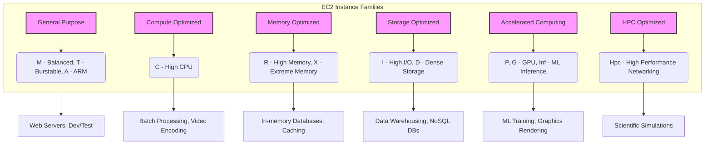

# AWS : EC2 Instance

-----

## 1\. Concept Overview

* AWS EC2 (Elastic Compute Cloud) instance types are pre-configured virtual servers (instances) with a specific combination of CPU, memory, storage, and networking capacity. 
* Think of them as different models of a car, each designed for a specific purpose. 
* For a software architect, understanding instance types isn't just about picking one; it's about selecting the **right tool for the job** to optimize for performance, cost, and scalability. 
* Choosing the wrong instance type can lead to overspending (paying for resources you don't use) or performance bottlenecks (not having enough resources).

-----

## 2\. Detailed Explanation

* AWS organizes EC2 instance types into **families** based on their core purpose. 
* Each family is identified by a letter. Within a family, there are different **generations** (a number, e.g., `m6` is a newer generation than `m5`), and then various **sizes** (e.g., `large`, `xlarge`).

### The primary instance families are:

  * **General Purpose (A, T, M):** 
    * These instances provide a balanced mix of compute, memory, and networking resources. They're the go-to for most applications where the workload is not skewed towards a specific resource.

      * **T-Series (T2, T3, T4g):** **Burstable Performance Instances.** 
        * They provide a baseline CPU performance with the ability to "burst" to a higher level when needed. 
        * They earn "CPU Credits" when idle and spend them when bursting. Ideal for workloads with unpredictable CPU usage, like web servers or development environments. 
        * `T4g` instances use AWS Graviton processors, which can offer better price performance.
      * **M-Series (M5, M6g, M7g):** 
        * The most common general-purpose family. Offers a good balance of resources for applications **that need consistent performance**, like small to medium databases, enterprise applications, and caching fleets.

<br/>

  * **Compute Optimized (C):** 
    * Designed for compute-intensive workloads that benefit from high-performance processors. 
    * They have a high ratio of CPU to memory.

      * **Use Cases:** 
        * Batch processing, 
        * High-performance web servers, 
        * Media transcoding, 
        * High Performace computing (HPC), 
        * Dedicated Game Servers and 
        * Scientific modeling & machine learning inference engines.

<br/>

  * **Memory Optimized (R, X, Z):** Geared towards workloads that process large datasets in memory. 
  * They have a high ratio of memory to CPU.

      * **Use Cases:** 
        * High-performance relational/non-relational databases, 
        * In-memory databases optimized for BI, 
        * Distributed web scale cache stores
        * Real-time big data analytics, and 
        * Large-scale data processing engines (e.g., Spark).

<br/>

  * **Storage Optimized (I, D, H):** 
    * Ideal for workloads that require high, sequential read and write access to very large datasets on local storage. 
    * They come with a large amount of fast local storage.

      * **Use Cases:** 
        * Relational & NoSQL databases (Cassandra, MongoDB), 
        * High frequency online transcation processing (OLTP) Systems,
        * Cache for in-memory databases (e.g. Redis)
        * Data warehousing applications and 
        * Distributed file systems.

<br/>

  * **Accelerated Computing (P, G, F, Inf):** 
    * Uses hardware accelerators, or co-processors, to perform functions more efficiently than is possible with CPUs alone.

      * **P-Series & G-Series:** 
        * Equipped with NVIDIA GPUs, perfect for machine learning training, scientific simulations, and graphics rendering.
      * **Inf-Series:** 
        * Features AWS Inferentia chips, purpose-built for high-performance machine learning inference at a low cost.

<br/>

  * **High Performance Computing (Hpc):** 
    * These instances are purpose-built to offer the best price-performance for running HPC workloads at scale. 
    * They provide high-throughput networking and are ideal for tightly coupled applications.

      * **Use Cases:** 
        * Complex simulations, 
        * Scientific modeling, and 
        * Other large-scale computational tasks.

-----

## 3\. Code Examples

* While EC2 instance types are a configuration choice, here's a conceptual representation of how you might define an instance in a **Terraform** script, which is a common practice for infrastructure as code. 
* This example highlights how the instance type is a critical parameter.

```terraform
resource "aws_instance" "app_server" {
  # The AMI (Amazon Machine Image) for the instance
  ami           = "ami-0c55b159f2f534149"  

  # The key parameter: selecting the instance type
  instance_type = "m5.large" # A General Purpose instance

  tags = {
    Name = "MyWebAppServer"
  }
}

resource "aws_instance" "ml_trainer" {
  ami           = "ami-0c55b159f2f534149"
  
  # A different instance type for a different workload
  instance_type = "g5.xlarge" # An Accelerated Computing instance with GPUs

  tags = {
    Name = "MLTrainingServer"
  }
}
```

-----

### 4\. Diagrams

**An overview representation of EC2 instance types**



-----

### 5\. Real-World Applications

  * **Web Servers & Microservices:** 
    * A common pattern for a low-to-moderate traffic web application is to use **T-series** instances (e.g., `t3.micro`) due to their cost-effectiveness and ability to handle occasional traffic spikes. 
    * For more consistent, higher-traffic sites, **M-series** instances (e.g., `m5.large`) provide stable performance.
  * **Data Processing:** 
    * A Hadoop cluster would likely use **Storage Optimized (I-series)** instances for fast access to HDFS data, or **Memory Optimized (R-series)** if a large portion of the processing is in-memory (e.g., Spark).
  * **AI/Machine Learning:** 
    * For training complex deep learning models, you'd use a **P-series** or **G-series** instance with powerful GPUs. 
    * For deploying the trained model for real-time predictions (inference), you might use a more cost-effective `Inf` instance.
  * **Databases:** 
    * Relational databases like MySQL or PostgreSQL that require a large amount of RAM for caching would be best suited for **Memory Optimized (R-series)** instances.

-----

### 6\. Advantages & Drawbacks

**Advantages:**

  * **Flexibility and Customization:** 
    * AWS provides a vast array of instance types, allowing you to fine-tune your resource allocation to match your specific application needs.
  * **Cost Optimization:** 
    * By choosing the right instance type, you can avoid paying for unused resources. 
    * For example, a `t3.micro` for a dev environment is far cheaper than a `c5.large`.
  * **Performance:** 
    * Choosing a purpose-built instance family (e.g., `C` for CPU-heavy tasks) ensures your application gets the necessary power to run efficiently.

**Drawbacks:**

  * **Complexity of Choice:** 
    * The sheer number of instance types can be overwhelming, leading to analysis paralysis or a poor choice.
  * **Vendor Lock-in:** 
    * Applications can be tightly coupled to specific AWS instance features, making it difficult to migrate to other cloud providers.
  * **Underutilization/Overprovisioning:** 
    * Despite the options, it's common for teams to choose a "one-size-fits-all" instance type, leading to wasted resources or performance issues.

-----

### 7\. Trade-offs

  * **T-series vs. M-series:** 
    * Choose **T-series** if you prioritize cost and your workload has variable CPU usage. 
    * Choose **M-series** if you need consistent, predictable performance and are willing to pay for it. 
    * The trade-off is **cost vs. consistent performance**.
  * **R-series vs. M-series:** 
    * Use **R-series** for memory-bound applications (like large caches) and **M-series** for balanced workloads. 
    * The trade-off is **specialization vs. versatility**.
  * **Intel/AMD vs. Graviton:** 
    * Graviton-based instances (`g` suffix, e.g., `m6g.large`) often offer a **better price-to-performance ratio** for many workloads, but they use ARM processors. 
    * You need to ensure your application (and its dependencies) is compatible with the ARM architecture. 
    * The trade-off is **cost efficiency vs. potential compatibility overhead**.

-----

### 8\. Best Practices

1.  **Start with General Purpose:** For new applications or unknown workloads, begin with an `M-series` or `T-series` instance.
2.  **Monitor Your Workload:** Use **Amazon CloudWatch** to monitor key metrics like CPU utilization, memory usage, and network I/O. This data will tell you if your current instance type is a good fit.
3.  **Use AWS Compute Optimizer:** This free AWS service analyzes your historical usage and recommends the optimal EC2 instance type for your workloads.
4.  **Right-size Regularly:** As your application evolves, it's resource needs change. Periodically review and adjust your instance types to ensure you're not over-provisioned.
5.  **Leverage Burstable Instances:** For dev, test, and other non-production environments, use `T-series` instances to save on costs.
6.  **Consider Reserved Instances/Savings Plans:** Once you've right-sized your instances and have a predictable long-term workload, use these pricing models to significantly reduce costs.

-----

### 9\. Interview Angle

**Possible Questions:**

  * "You're designing a new microservice. How would you choose the right EC2 instance type?"
  * "Explain the difference between a `t3.large` and an `m5.large` instance."
  * "What is a burstable instance, and when would you use one?"
  * "How would you optimize the cost of an EC2-based application?"

**How to Answer Confidently:**

  * Start by categorizing the instance types into the five main families (General Purpose, Compute, Memory, Storage, Accelerated). 
  * This shows you have a structured understanding.
  * Mention the key characteristics of each family (CPU, RAM, Storage).
  * Use the "right tool for the job" analogy. 
    * For the microservice question, say you'd start with a general-purpose instance and use CloudWatch to monitor its performance, then right-size it to a more specialized instance if needed.
  * For the `t3.large` vs `m5.large` question, highlight the core difference: 
    * `t3` is burstable (cost-effective for variable workloads), 
    * while `m5` provides a consistent baseline (better for predictable, heavy workloads).
  * For cost optimization, mention the steps: 
    * **1. Right-size** (get the right instance type), 
    * **2. Use `T` instances** for non-prod, and 
    * **3. Use Reserved Instances or Savings Plans** for long-term commitment.

-----

### 10\. Online References

  * **AWS Official EC2 Instance Types Page:** [https://aws.amazon.com/ec2/instance-types/](https://aws.amazon.com/ec2/instance-types/)
  * **AWS Compute Optimizer:** [https://aws.amazon.com/compute-optimizer/](https://aws.amazon.com/compute-optimizer/)
  * **EC2 Instance Comparison:** [https://instances.vantage.sh/](https://instances.vantage.sh/) 
    * A great third-party tool for comparing specs and costs.

-----

### 11\. Summary

* AWS EC2 instance types are categorized into families (General Purpose, Compute, Memory, Storage, Accelerated, HPC) to provide optimized resource configurations for different workloads. 
  * The naming convention (`family.generation.size`) helps identify the type. 
* The key to effective usage is to understand your application's resource needs and choose the instance that provides the best balance of performance and cost. 
* Use monitoring tools like CloudWatch and services like Compute Optimizer to continuously right-size your instances and avoid overspending.

-----

### 12\. Extra Insights

**Analogy:**
Think of EC2 instance families like different professional athletes:

  * `T-series` is a marathon runner. It's built for endurance and can sprint when needed, but can't sustain top speed forever.
  * `C-series` is a sprinter. It's built for short, powerful bursts of activity (high CPU).
  * `R-series` is a weightlifter. It's all about lifting heavy loads (large datasets) efficiently.
  * `G-series` is a Formula 1 driver. It uses specialized hardware (a super-powerful engine/GPU) to achieve extreme performance for niche tasks.

**Checklist for Choosing an Instance Type:**

1.  **Workload Profile:** Is it CPU-intensive, memory-intensive, or I/O-intensive?
2.  **Performance Needs:** Does it require consistent, high performance or is it a bursty workload?
3.  **Cost Constraints:** Is this a dev environment or a production application?
4.  **Processor Architecture:** Is the application compatible with ARM (Graviton)?
5.  **Storage Needs:** Does it require fast local storage or is EBS sufficient?

-----

### 13\. For AWS Certification Exam Perspective

  * **Key Families:** 
    * You must know the five main families and their primary use cases. `T` (burstable), `M` (general purpose), `C` (compute), `R` (memory), `I/D` (storage), and `G/P` (accelerated).
  * **Burstable Instances:** 
    * The concept of **CPU Credits** for T-series instances is a frequent test topic. Understand how they earn and spend credits and the difference between Standard and Unlimited modes.
  * **Naming Convention:** 
    * Be able to decode an instance name like `m6g.xlarge`. Know that `m` is the family, `6` is the generation, `g` is the processor type (Graviton), and `xlarge` is the size.
  * **Cost Optimization:** 
    * Understand that choosing the **right instance type** is the first step in cost optimization, followed by using cost models like Reserved Instances, Savings Plans, and Spot Instances.
  * **Exam Questions:** 
    * Expect scenario-based questions asking you to recommend the best instance type for a given workload (e.g., "A customer has a large in-memory database. 
    * Which instance type should you recommend?"). 
      * The answer would be a memory-optimized instance like an `R-series` or `X-series`.


---

<ul class="flex-list">
    <li>
        <a href="https://srvivek1.github.io/">Go to Home</a>
    </li>
    <li><a href="https://github.com/SRVivek1/">Author: Vivek K Singh</a></li>
</ul>

<center>
<p> ------ </p>
</center>

<!-- HTML styling -->
<style>
table, th, td {
  border: 1px solid black;
  border-collapse: collapse;
}
heading {
  color: blue;
  font-size: 20px;
}

.flex-list {
    display: flex; /* Makes the <ul> a flex container */
    list-style-type: none;
    margin: 0;
    padding: 0;
    justify-content: space-between;
}

.flex-list li {
    /* No display change needed, flex items are already inline */
    margin-right: 20px;
}

</style>