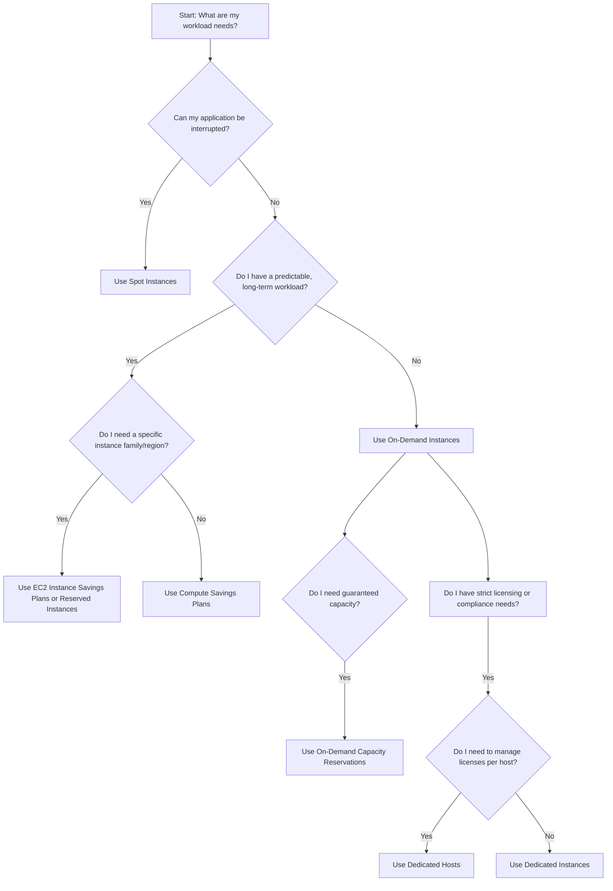
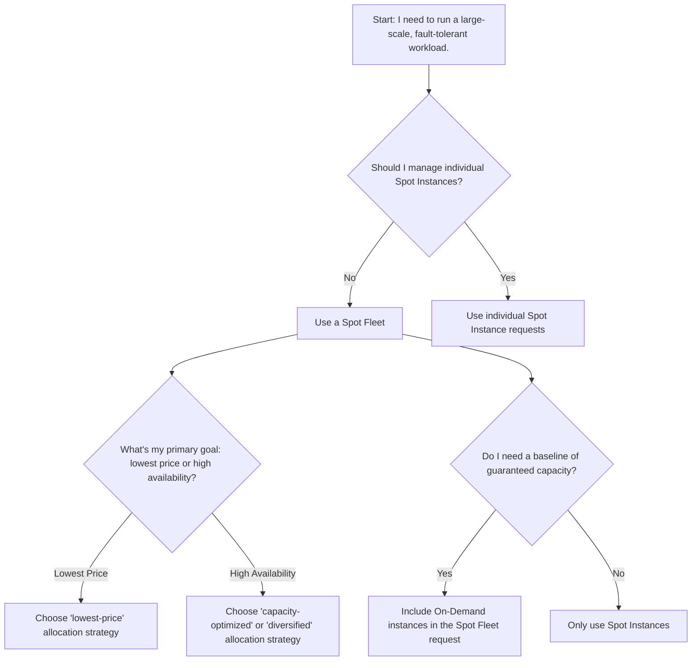

# AWS : EC2 Instance purchasing options

-----

As a software architect, understanding the different EC2 purchasing options is crucial for optimizing cost, performance, and reliability. This is a core topic for AWS certifications and architect interviews. Let's break down the key EC2 purchasing models.

## 1\. Concept Overview

AWS offers various ways to pay for EC2 instances, moving beyond the simple pay-as-you-go model. These options allow you to trade off flexibility for cost savings. 
* The fundamental concept is a **spectrum of commitment**: 
  * The more you commit (in time or usage), the greater the discount you receive. 
  * An architect's job is to analyze the workload and choose the right mix of these options to meet business needs at the lowest possible cost.

-----

## 2\. Detailed Explanation

### On-Demand Instances

This is the most flexible option. You pay for compute capacity by the hour or second (with a 60-second minimum) with no long-term commitments.
* Pay for what you use:
  * Linux or Windows - Billing per second, after the first minute.
  * All other operating systems - billing per hour.
* Has the highest cost but no upfront payment.
* No long-term commitment.

  * **When to use:** 
    * For unpredictable or spiky workloads, development and testing environments, or applications that cannot be interrupted.
  * **Why it's used:** 
    * It offers maximum flexibility and requires no upfront payment. You simply pay for what you use.

* **Recommended for** short-term and un-interrupted workloads, where you can't predict how the application will behave. 

-----

### Reserved Instances (RI)

Reserved Instances are a **billing discount** applied to your On-Demand usage. They are not a physical instance but a reservation of a specific configuration (Instance Type, Region, Tenency, OS). 
* **Reserved Instance's scope -** Regionl or Zonal (reserve capacity in an AZ).
* You commit to a **1-year (+discount) or 3-year (+++discount) term** for a significant discount **(up to 72%)**.
* **Different RI options:**
  * **Standard RI:** 
    * Offers the highest discount but is the least flexible. 
    * The reservation is tied to a specific instance family, type, and region, and cannot be changed.
  * **Convertible RI:** 
    * Provides a lower discount but allows you to change the instance family, OS, and tenancy during the term. 
    * This is great for evolving applications.
      * Up to **66% discount** available.
  * **Payment Options:** 
    * You can choose to pay **All Upfront** (largest discount), **Partial Upfront** (less discount), or **No Upfront** (smallest discount).

* **Recommended for** steady-state usage applications (think database).
* **Note:** 
  * You can buy and sell in the **Reserved Instance Marketplce**.
  * The discount % may change over time by AWS. The exact number is not needed for the exam.

-----

### Savings Plans

This is a more flexible and modern alternative to Reserved Instances that offer low prices on Amazon EC2, AWS Lambda, and AWS Fargate usage. You commit to a consistent amount of compute usage per hour, measured in dollars ($/hr) for a 1 or 3 year term.
* Usages beyond EC2 Savings Plans us billed at the On-Demand price.
* Flexibile acreoss:
  * Instance Size (e.g. m5.xlarge, m5.2xlarge)
  * OS (e.g.Linux, Windows)
  * Tenancy (Host, Dedicated, Default)

####  AWS offers two types of Savings Plans:
  1. **Compute Savings Plans:** 
    * The most flexible. 
    * The discount automatically applies to any EC2 instance usage, regardless of instance family, size, region, OS, or tenancy. 
    * It also applies to AWS Fargate and AWS Lambda.
    * Reduce your costs by up to 66%.
    * **For example,** with Compute Savings Plans, 
      * You can change from C4 to M5 instances, 
      * Shift a workload from EU (Ireland) to EU (London), or 
      * Move a workload from EC2 to Fargate or Lambda at any time and automatically continue to pay the Savings Plans price.
  2. **EC2 Instance Savings Plans:** 
    * Offers higher savings than Compute Savings Plans but is less flexible and locked to a specific instance family and AWS region (e.g. M5 in us-east-1).
    * The commitment is to a specific EC2 instance family in a region (e.g. M5 usage in N. Virginia). 
    * But you can change instance size, OS, and tenancy.
      * **For example,** you can move from c5.xlarge running Windows to c5.2xlarge running Linux.

-----

### Spot Instances

These are unused EC2 instances available at a steep discount (up to 90% off the On-Demand price). Spot Instance prices are set by Amazon EC2 and adjust gradually based on long-term trends in supply and demand for Spot Instance capacity.
* Most cost-efficient instances, Useful for workloads that are resilient to failure.
  * Batch jobs
  * Data Analysis
  * Image processing
  * Any distributed workloads
  * Workloads with flexible start and end time.
* **Not suitable** for critical jobs or databases.
* You can loose these instances any point of time if your max prices is less than the current spot price.
* The catch? AWS can terminate them with a 2-minute warning if the capacity is needed for On-Demand or Reserved Instance users.
* You can only cancel Spot Instance requests that are open, active or disabled.
  * Cancelling a Spot Request does not terminated instances, you must first cancel a Spot Request, and then terminate the associated Spot Instances. 
* Advisor: https://aws.amazon.com/ec2/spot/instance-advisor/

* **Note:** 
  * T4g and T3 instances launch as unlimited by default. The unlimited mode is a credit configuration option for burstable performance instances.
    * If you launch T4g or T3 Spot Instances as unlimited and plan to use them immediately and for a short duration, with no idle time for accruing CPU credits, **you will incur charges for surplus credits**. 
    * If the average CPU usage over a 24-hour period exceeds the baseline, you will also incur charges for surplus credits. 
      * We recommend that you launch your T4g or T3 Spot Instances in standard mode to avoid paying higher costs.

  * **When to use:** For fault-tolerant, stateless, or flexible workloads like big data processing, CI/CD, batch jobs, or rendering farms.
  * **Why it's used:** Tremendous cost savings. The key is that the application must be designed to handle interruptions gracefully.

#### EC2 Spot Instance Requests
* Can get a discount f up to 90% compared to On-Demand/
* Define **Max sport price** and get the instance while **current sport price < max**
  * The hourly sport price varies based on offer and capacity/
  * If the current spot price > your max price you can choose to stop or terminate your instance with a 2-minute grace period.
* Other strategy: Spot Block
  * "block" sport instance during a specified time frame (1 to 6 hours) without interruption.
  * **Note:**
    * Spot Blocks are no longer availale to new AWS customers since July 1st 2021 and won't be supported after December 31st, 2022.
    * Still, they might appear in the exam, so keep a note of it.

-----

### Dedicated Hosts

A physical server with EC2 instance capacity fully dedicated to your use. You have full control and visibility over the underlying hardware, including the number of sockets and physical cores.
  * **When to use:** 
    * Primarily for bringing your own software licenses (**BYOL**) that require per-socket, per-core, or per-VM licensing. 
    * Also used for strict regulatory or compliance requirements.
  * **Billing:** You are billed for the entire physical host, not per instance, so it's a fixed cost.
  * **Purchasing Options:**
    * **On-Demand -** Pay per second for active Dedicated Host.
    * **Reserved:** 1 or 3 years (No Upfront, Partial Upfront, All Upfront).
* **Note:** The most expensive option.

-----

### Dedicated Instances

Instances that run on hardware dedicated to a single customer account, physically isolated from other accounts. It may share hardware with other instances in same account.
* Unlike Dedicated Hosts, you don't have visibility or control over the host hardware and can't use your own licenses that are tied to physical cores/sockets.

  * **When to use:** For compliance or security requirements that mandate physical isolation from other customers.
  * **Billing:** You are charged at a premium over On-Demand rates.

 

#### Dedicated Instances vs Dedicated Hosts

| Characteristic | Dedicated Instances | Dedicated Hosts |
| -------------- | ------------------- | --------------- |
| Enables the use of dedicated Physhical server |  X  | X |
| For instance billing (Subject to a $2 per region fee) | X |  |
| Per host billing | | X |
| visibility of socket, cores, Host ID | | X |
| Affinity between a host and instance | | X |
| Targated instance placement |  | X |
| Automate Instance placement | X | X |
| Add capacity using an allocation request |  | X |

-----

### On-Demand EC2 Capacity Reservations

* This is not a pricing model and has no billing discount but a way to reserve capacity. 
* Allows you to reserve compute capacity for your Amazon EC2 instances in a specific Availability Zone (AZ) for any duration. 

  * **When to use:** For mission-critical workloads that require guaranteed capacity, especially in regions with high demand.
    * **Suitable for** short-term, uninterrupted workloads that needs to be in a specific AZ.
    * **Capacity Reservation for immediate use:** No term commitment required for immediate use.
    * **Future-Dated Capacity Reservation:** You specify the future date at which you need the Capacity Reservation to become available for use & also specify a commitment duration to keeping the requested capacity in your account after the specified date. 
    * At the requested date and time, the Capacity Reservation becomes available for use and the commitment duration starts.
      * During the commitment duration, **you can't decrease the instance count** or **commitment duration below your initial commitment**, or **cancel the Capacity Reservation**. 
      * After the commitment duration elapses, you can modify the Capacity Reservation in any way or cancel it if you no longer need it.
 

* **Key Note:** 
    * Capacity Reservations can only be used by instances that match their attributes.
      * By default, Capacity Reservations automatically match new instances and running instances that have matching attributes (instance type, platform, Availability Zone, and tenancy).
    * You pay the On-Demand rate for the reserved capacity whether you use it or not. 
      * It's often combined with Savings Plans or Reserved Instances to get a billing discount on top of the reserved capacity.
    * Future-dated Capacity Reservations are for helping you launch and cover incremental instances, and not to cover existing running instances. 
      * If you need to cover existing running instances, use Capacity Reservations that start immediately instead.

-----

### Spot Fleets

* A Spot Fleet is a **collection of Spot Instances**, and optionally On-Demand Instances, that are launched and managed automatically to meet a specific target capacity. 
  * **Spot Fleets = *set of Spot Instances + (optional) On-Demand Instances***
* You create a single request for a fleet of instances, specifying multiple instance types, Availability Zones, and a maximum price. AWS will then fulfill the request by launching instances from the pools that offer the lowest prices or best capacity at that moment.

  * **Key Concept:** Spot Fleets simplify the management of a large number of diverse Spot Instances. Instead of managing individual Spot requests, you manage a single fleet request.
  * **When to use:** For large-scale, distributed, and stateless applications that can tolerate interruptions, such as big data processing (Hadoop, Spark), containerized workloads (ECS, EKS), or rendering farms. It's the go-to service for orchestrating Spot capacity at scale.
  * **Why it's used:** It automates the process of finding and using the cheapest available Spot capacity. By diversifying across multiple instance types and Availability Zones, it significantly increases the chance of the fleet maintaining its target capacity, even if a particular pool becomes unavailable.

* The Spot Fleet will try to meet the target capacity with price constraints
  * Define possible launch pools: instance type (m5.large), OS, Availability Zone.
  * Can have multiple launch pools, so that the fleet can choose.
  * Spot Fleet stops launching instanes when reaching capacity or max cost.

#### Allocation Strategies

Spot Fleets are highly configurable and offer different allocation strategies to meet your specific needs:
  * **`lowest-price`:** 
    * Launches instances from the Spot pool (instance type in an Availability Zone) that has the lowest price at the time of the request. 
    * Ideal for short-lived, extremely cost-sensitive workloads.
  * **`diversified`:** 
    * Distributes instances across all the specified Spot pools. 
    * This minimizes the impact of a single pool's interruption, making it suitable for longer-running, resilient workloads.
  * **`capacity-optimized`:** 
    * Launches instances from the pools with the most available capacity. 
    * This is the recommended strategy for most use cases as it reduces the likelihood of interruptions by choosing pools that are less likely to have sudden price spikes or be reclaimed.
  * **Price Capacity Optimized (recommended):**
    * Pools with highest capacity aailable, then select the pool with the lowest price (best choice for most workloads).

* **Note:** Allows us to automatically request Spot Instaces with the lowest price.

-----

### 3\. Code Examples

N/A - This topic is about billing and provisioning, not code implementation.

-----

### 4\. Diagrams

**EC2 Purchasing Options - Cost vs. Flexibility**

**Diagram: Decision Flow**

-----

**Spot Fleet: Decision Flow**

-----

### 5\. Real-World Applications

  * **Netflix:** Uses a mix of On-Demand, Reserved, and Spot Instances to manage their massive streaming and data processing workloads. They use Spot Instances for video encoding and non-critical batch jobs to save costs.
  * **Gaming Companies:** Often use Spot Fleets to spin up temporary, large-scale compute clusters for game server testing, ensuring they can handle millions of concurrent players without paying a fortune.
  * **Financial Institutions:** May use Dedicated Instances or Dedicated Hosts to meet stringent regulatory compliance requirements, ensuring their data is physically isolated.
  * **SaaS Startups:** A new startup might start with On-Demand Instances for flexibility and ease of use. As their business stabilizes and they identify consistent workloads, they transition to Savings Plans to reduce costs.

-----

### 6\. Advantages & Drawbacks

  * **On-Demand:**
      * **Pros:** Ultimate flexibility, no commitment.
      * **Cons:** Highest cost, no guaranteed capacity.
  * **Reserved Instances/Savings Plans:**
      * **Pros:** Significant cost savings (up to 72%), predictable billing.
      * **Cons:** Requires commitment, less flexible than On-Demand. RI is less flexible than SP.
  * **Spot Instances:**
      * **Pros:** Massive cost savings (up to 90%).
      * **Cons:** Can be interrupted at any time, not suitable for stateful or critical workloads.
  * **Dedicated Hosts/Instances:**
      * **Pros:** Physical isolation, compliance benefits, BYOL support (Hosts).
      * **Cons:** Premium cost, management overhead (Hosts).
  * **Capacity Reservations:**
      * **Pros:** Guaranteed capacity, crucial for mission-critical apps.
      * **Cons:** No discount, you pay even if not used.
  * **Spot Fleets:**
      * **Pros:** Automates the management of Spot Instances, significantly increases reliability by diversifying across pools, and can include On-Demand instances for guaranteed baseline capacity.
      * **Cons:** Not suitable for non-interruptible workloads. Can be complex to configure initially due to the various options.
-----

### 7\. Trade-offs

The primary trade-off is **Cost vs. Flexibility**.

  * **On-Demand** gives you maximum flexibility at the highest cost.
  * **Spot Instances** give you maximum cost savings with the least flexibility (due to interruption risk).
  * **Reserved Instances/Savings Plans** strike a balance, offering good discounts for a long-term commitment.

The decision is about finding the right equilibrium for your specific application. A well-designed architecture will often use a combination of these.

-----

### 8\. Best Practices

  * **Analyze your workload:** Use AWS Cost Explorer to analyze historical usage and identify predictable workloads that can benefit from Savings Plans or RIs.
  * **Adopt a "blended" approach:** Use a combination of On-Demand for dynamic, spiky workloads, Savings Plans for stable compute, and Spot Instances for fault-tolerant batch jobs.
  * **Automate with AWS tools:** Use Auto Scaling Groups with a mix of On-Demand and Spot instances to automatically manage capacity and costs. Use AWS Budgets to monitor spending.
  * **Start small:** For long-term commitments, start with a 1-year Savings Plan and monitor usage.
  * **Choose Savings Plans over Reserved Instances:** For new commitments, Savings Plans offer similar discounts with much greater flexibility. RIs are still useful for specific use cases like reserving capacity in a particular AZ.

-----

### 9\. Interview Topics

  * **"What are the different EC2 purchasing options?"**
      * ***Answer:*** Start by listing them (On-Demand, RIs, SPs, Spot, Dedicated) and then provide a one-sentence summary for each. Frame the discussion around the core trade-off: cost vs. flexibility.
  * **"Explain the difference between Reserved Instances and Savings Plans."**
      * ***Answer:*** Highlight that SPs are a more flexible, dollar-based commitment that applies across instance types and services (Compute SPs), while RIs are tied to a specific instance configuration. Mention that AWS now recommends SPs for most use cases.
  * **"When would you use Spot Instances?"**
      * ***Answer:*** Use the keywords "fault-tolerant," "stateless," "non-critical," and "interruptible." Give concrete examples like big data processing (Spark, Hadoop), video rendering, and CI/CD pipelines.
  * **"How would you optimize EC2 costs for a new application?"**
      * ***Answer:*** Start with On-Demand for development. Once the application is in production and you have a stable baseline of usage (e.g., a database and a web server), purchase a Savings Plan for that base load. Use Auto Scaling with a mix of On-Demand and Spot instances to handle the variable traffic.
  * **"What is the difference between a Spot Instance and a Spot Fleet?"**
      * ***Answer:*** A Spot Instance is a single EC2 instance launched with the Spot pricing model. 
      * A Spot Fleet is a managed service that automatically launches and maintains a *collection* of Spot Instances (and optionally On-Demand) based on your target capacity, diversified across different instance types and Availability Zones to increase reliability and availability.
  * **"How would you use a Spot Fleet to run a large data processing job?"**
      * ***Answer:*** I would create a Spot Fleet request and specify multiple instance types (e.g., m5.xlarge, m5.2xlarge, c5.xlarge) to diversify the capacity pools. 
      * I would choose the `capacity-optimized` allocation strategy to reduce the chance of interruptions. If the job requires a minimum baseline of capacity to avoid a complete stall, I would set a small portion of the target capacity to be fulfilled by On-Demand instances.
-----

### 10\. Online References

  * [AWS EC2 Pricing](https://aws.amazon.com/ec2/pricing/)
  * [AWS Savings Plans](https://aws.amazon.com/savingsplans/)
  * [AWS re:Invent 2024 - Managing Amazon EC2 capacity and availability (CMP319)](https://www.youtube.com/watch?v=TyFMsx9PVeM)

-----

### 11\. Summary

The AWS EC2 purchasing options provide a powerful toolkit for cost optimization. **On-Demand** is for flexibility, **Savings Plans/Reserved Instances** are for long-term savings on predictable workloads, and **Spot Instances** are for huge discounts on interruptible jobs. **Dedicated Hosts/Instances** serve specific compliance and licensing needs, while **Capacity Reservations** ensure availability for critical applications. The best strategy is a thoughtful combination of these to match your application's unique requirements.

-----

### 12\. Extra Insights

Think of it as renting a car:

  * **On-Demand:** Renting a car for a day. You pay the standard rate, but you can return it anytime.
  * **Reserved Instances/Savings Plans:** Leasing a car for a year or more. You get a much better monthly rate, but you're committed.
  * **Spot Instances:** Renting a car that's not currently being used by anyone else, at a massive discount. The catch is that the owner can call you and ask for it back with a 2-minute warning.
  * **Dedicated Hosts:** Buying a parking space in a specific garage so you can park your car there and only your car, always. This is a good option if you have a special vehicle (license) that only works in that specific garage.

### 13\. For AWS certification exam perspective:

  * **Key Notes:**
      * Understand the key differences between **Savings Plans** and **Reserved Instances**, especially that SPs are a dollar-per-hour commitment and RIs are a commitment to a specific instance configuration.
      * Remember that **Reserved Instances** and **Savings Plans** apply to your billing, not a physical instance.
      * **Spot Instances** can be terminated with a two-minute warning.
      * **Dedicated Hosts** are required for certain server-bound licenses (BYOL).
      * **Capacity Reservations** are for guaranteed capacity, not cost savings. They are billed at the On-Demand rate.
      * The highest potential savings come from a 3-year term with a full upfront payment.
      * A common trick question on the exam is about using On-Demand instances vs. Reserved Instances for a 24/7 workload; the correct answer is almost always the more cost-effective Reserved Instance.

The video below explains the difference between On-Demand and Spot Instances in a concise way.
[AWS re:Invent 2024 - Managing Amazon EC2 capacity and availability (CMP319)](https://youtu.be/TyFMsx9PVeM)

-----

<ul class="flex-list">
    <li>
        <a href="https://srvivek1.github.io/">Go to Home</a>
    </li>
    <li><a href="https://github.com/SRVivek1/">Author: Vivek K Singh</a></li>
</ul>

 ------ 

<!-- HTML styling -->
