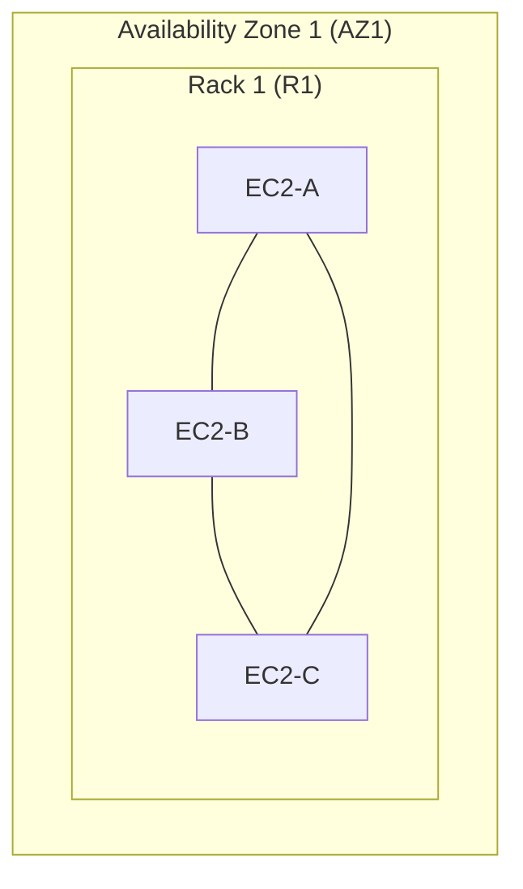
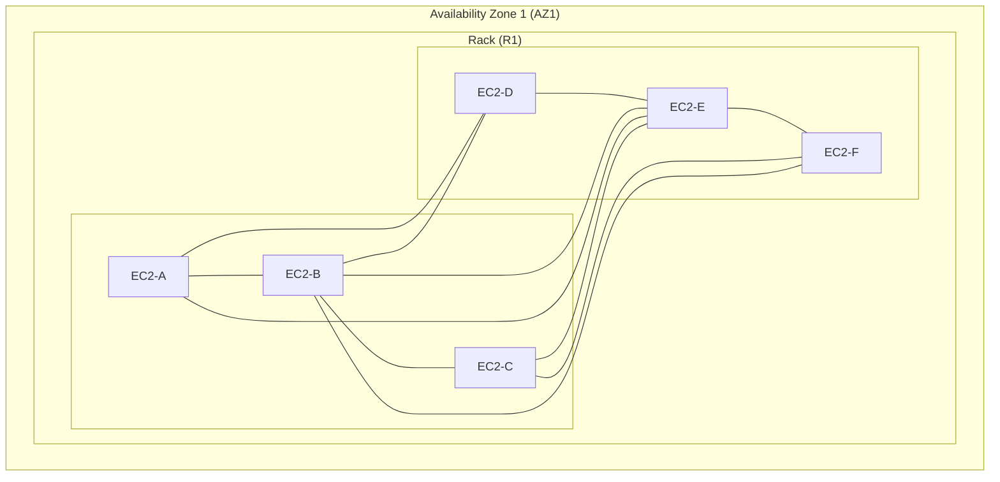
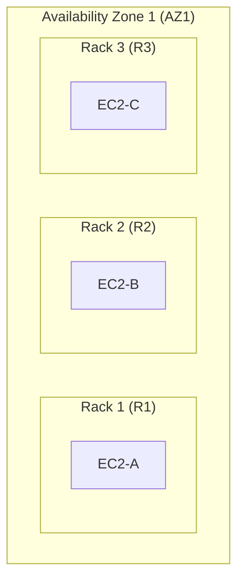
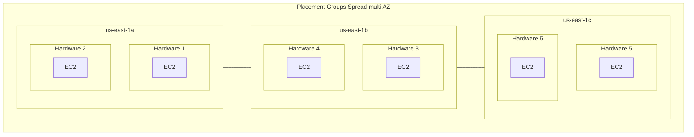
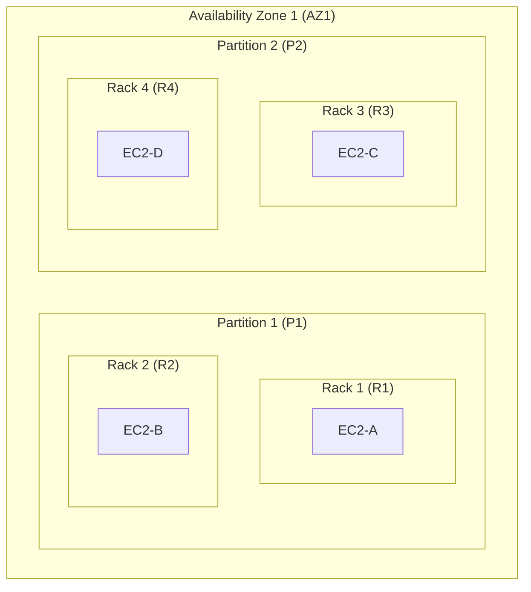

# AWS : EC2 Instance Placement Groups

-----

## **1. Concept Overview**

AWS EC2 Placement Groups are a logical grouping of EC2 instances **within a single AWS region** that allow you to influence the placement of your instances to meet specific requirements for performance, latency, and fault tolerance.
* From an architect's perspective, placement groups are a low-level control mechanism that provides granular control over the physical proximity or isolation of your instances on the underlying AWS hardware.
* They are a critical tool for optimizing distributed applications and ensuring high availability.

-----

## **2. Detailed Explanation**

AWS offers three types of placement group strategies, each designed for a different use case:

  * **Cluster Placement Group:** 
    * This strategy packs instances close together within a **single Availability Zone (AZ)** to achieve low network latency and high network throughput. 
    * Instances are **placed on the same rack or network switch**, which is ideal for tightly-coupled, network-intensive applications. 
    * **Note:** However, this also means they share the same underlying hardware, making them vulnerable to correlated hardware failures.
  * **Spread Placement Group:** 
    * This strategy places a small number of critical instances on **distinct underlying hardware** to **reduce the risk of simultaneous failures**. 
    * Each instance in a spread placement group is **launched on a separate rack, with its own network and power source**. 
    * This is perfect for applications that have a few critical instances that must be kept as isolated as possible for maximum fault tolerance. 
    * **Note:** A spread placement group can also span multiple Availability Zones.
      * That is we can configure to spread instances across underlying hardware (max 7 instances per group per AZ).
  * **Partition Placement Group:** 
    * This strategy divides a placement group into logical partitions, where each partition is placed on its own set of racks. 
    * **No two partitions in a group share the same underlying hardware.** 
    * This provides isolation and fault tolerance, while still allowing for a larger number of instances than a spread placement group. 
    * It's ideal for large-scale distributed and replicated workloads like Apache Hadoop, Apache Cassandra, and Apache Kafka.
    * **Summary:** Spreads instances across many different partitions (which rely on diferent set of racks) withing an AZ.
      * Scales to 100s of EC2 instances pergroup (Hadoop, Cassandra, Kafka).

-----

## **3. Code Examples**

You typically define placement groups and then launch instances into them. Here's a quick example using the AWS CLI and a `run-instances` command with a placement group.

```bash
# First, create the placement group
aws ec2 create-placement-group --group-name MyClusterGroup --strategy cluster

# Then, launch an instance into the placement group
aws ec2 run-instances --image-id ami-12345 --count 1 --instance-type c5.large --placement-group-name MyClusterGroup
```

For more complex scenarios, you would use a CloudFormation or Terraform template to define the infrastructure as code.

-----

## **4. Diagrams**

### **Cluster Placement Group**

#### Simple EC2 placment



<br/>

  * **Explanation:** 
    * Instances A, B, and C are all in the same rack, providing very low latency and high throughput. 
    * However, a failure of Rack 1 would affect all three instances.

<br/>

#### More complex EC2 placement



<br/>

### **Spread Placement Group**

#### A sample single AZ Spread placement



  * **Explanation:** 
    * Each instance (A, B, and C) is placed on a distinct rack, ensuring that a single hardware failure affects only one instance. This provides maximum fault tolerance.


<br/>

#### A sample multi AZ Spread placement




<br/>

### **Partition Placement Group**



  * **Explanation:** 
    * Instances are grouped into logical partitions. 
      * Partition 1 (with instances A and B) and Partition 2 (with instances C and D) are on completely separate hardware. 
    * A rack failure would only affect the instances in that partition, providing a good balance of isolation and scalability for large distributed systems.

-----

## **5. Real-World Applications**

  * **Cluster:** 
    * High-Performance Computing (HPC) clusters, big data processing (e.g., Spark), real-time financial trading platforms, and any application where inter-node communication latency is a primary concern.
  * **Spread:** 
    * A few critical microservices that need to be highly available, such as primary and secondary instances of a database or a mission-critical web server, to prevent a single hardware failure from taking down the entire service.
  * **Partition:** 
    * Distributed databases like Cassandra, Hadoop (HDFS), and Hbase where data is replicated across different partitions to ensure that a rack failure doesn't result in data loss.

-----

## **6. Advantages & Drawbacks**

| Placement Group Type | Advantages | Drawbacks |
| :--- | :--- | :--- |
| **Cluster** | ✅ Great Network (10 Gbps bandwidth between instances with Enhanced Networking enabled - recommended), hence Low network latency and high throughput. | ❌ Single point of failure for the underlying hardware. Limited to a single AZ. |
| **Spread** | ✅ Maximum fault tolerance and hardware isolation. Can span multiple AZs. | ❌ Not scalable for large numbers of instances. Higher network latency than a cluster group. |
| **Partition** | ✅ Provides fault tolerance for large, distributed workloads. Allows for a large number of instances. | ❌ Can be more complex to manage than other types. Higher latency than a cluster group. |

-----

## **7. Trade-offs**

The main trade-off is between **performance** (low latency, high throughput) and **fault tolerance**.

  * If your primary concern is performance, you trade off fault tolerance for speed by using a **Cluster** placement group.
  * If your primary concern is fault tolerance, you trade off maximum performance for isolation by using a **Spread** or **Partition** placement group. A Spread group is for a few critical instances, while a Partition group is for large, distributed systems.

-----

## **8. Best Practices**

  * **Launch all instances at once:** 
    * To avoid capacity issues, launch all required instances in a placement group in a single `run-instances` request.
  * **Uniformity:** 
    * Use the same instance type for all instances within a cluster placement group to avoid mismatched network performance.
  * **Capacity Errors:** 
    * If you receive a capacity error, you may need to stop and start all instances in the placement group to see if they can be placed on a different set of hardware that has sufficient capacity.

-----

## **9. Interview Angle**

  * **Q:** What are EC2 Placement Groups and why are they used?
      * **Answer:** 
        * They are a logical grouping of instances to control their physical placement on AWS hardware. 
        * They are used to optimize for low latency (Cluster), high fault tolerance (Spread), or a balance of both for large systems (Partition).
  * **Q:** Explain the differences between the three types of placement groups.
      * **Answer:** 
        * **Cluster** is for tightly-coupled applications needing ultra-low latency, putting instances on the same rack. 
        * **Spread** is for critical, independent instances, putting each on separate hardware for maximum isolation. 
        * **Partition** is for large distributed systems like Hadoop, separating instances into logical partitions on different racks.
  * **Q:** A client has a small, critical application with 3 web servers and a database. They are very concerned about a single hardware failure. Which placement group would you recommend?
      * **Answer:** 
        * A **Spread** placement group. It's designed for a small number of instances that need to be on distinct hardware for maximum fault tolerance against correlated failures.

-----

## **10. Online References**

  * [AWS EC2 Placement Groups Documentation](https://docs.aws.amazon.com/AWSEC2/latest/UserGuide/placement-groups.html)
  * [AWS Solutions Architect Associate Exam Training](https://www.youtube.com/watch?v=jnpDHVvRbEc)

-----

## **11. Summary**

Placement groups are a fundamental AWS EC2 feature that provides fine-grained control over instance placement. They are essential for workloads that are either performance-critical (Cluster), fault-tolerant (Spread), or both at a larger scale (Partition). The choice of placement group is a key architectural decision that directly impacts the availability and performance of your application.

-----

## **12. Extra Insights**

Think of the three placement groups with this mnemonic:

  * **C**luster -\> **C**lose together (Low Latency)
  * **S**pread -\> **S**eparate (Max Fault Tolerance)
  * **P**artition -\> **P**artitions of a large system (Scalable Fault Tolerance)

-----

## **13. For AWS Certification Exam Perspective**

  * **Key Notes:**
      * **Cluster:** 
        * Remember **low latency** and **high throughput**. 
        * **It is always within a single AZ**.
        * Use cases are HPC, big data, and tightly-coupled applications.
      * **Spread:** 
        * Remember **maximum fault tolerance**. 
        * **Can span multiple AZs.**
        * Use cases are a small number of critical instances. 
      * **Partition:** 
        * Remember **large distributed systems** and **fault isolation** across logical groups.
        * **Supports up to 7 partitions per AZ.**
        * Use cases are Hadoop, Cassandra, Kafka. 
      * **General Rules:** You cannot move an existing instance into a placement group. You must stop and start the instance to apply a new placement group. If you get a "capacity" error, it means AWS couldn't find a contiguous block of hardware to meet your request. The solution is often to try again later or to choose a different instance type.
  
<br/>

  * **Example Question:** A company is running a distributed database with 50 nodes and wants to ensure that a single rack failure doesn't take down the entire system. They also want to be able to query which nodes are on which rack. Which placement group should they use?
      * **Answer:** A Partition placement group. It's built for large distributed systems, provides rack-level fault isolation, and gives you visibility into the partition ID of each instance, which can be mapped to a logical rack.

Watch this video to get a hands-on demonstration and in-depth explanation of AWS EC2 Placement Groups. [AWS EC2 Placement Groups Hands-on with In-depth Explanation](https://www.youtube.com/watch?v=0I6JlXsGsIY)

-----

<ul class="flex-list">
    <li>
        <a href="https://srvivek1.github.io/">Go to Home</a>
    </li>
    <li><a href="https://github.com/SRVivek1/">Author: Vivek K Singh</a></li>
</ul>

<center>
<p> ------ </p>
</center>

<!-- HTML styling -->
<style>
table, th, td {
  border: 1px solid black;
  border-collapse: collapse;
}
heading {
  color: blue;
  font-size: 20px;
}

.flex-list {
    display: flex; /* Makes the <ul> a flex container */
    list-style-type: none;
    margin: 0;
    padding: 0;
    justify-content: space-between;
}

.flex-list li {
    /* No display change needed, flex items are already inline */
    margin-right: 20px;
}

</style>