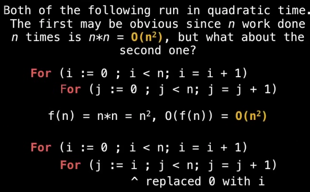
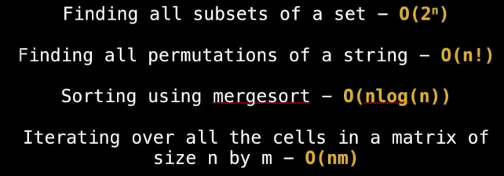

# Data Structucture and Algorithms
## Introduction
- **<ins>Data Structure</ins>**
  - They are essential ingredients for creating fast and powerful algorithms.
  - They help to manage and organize data.
  - They make code cleaner and easier to understand.
- **<ins>Abstract Data Types (ADT)</ins>**
  - ADT is an abstraction of data structure which provides only the interface to which a data structure must adhere to.
  - The interface does no give any specific detail about how something should be implemented or in what programming language.
- **<ins>Pros & Cons</ins>**

| Abstraction (ADT) | Implementation (DS) |
| ----------------- | ------------------- |
| List    | Dynamic Array   Linked List |
| Queue   | LinkedList Based Queue   Array based queue   Stack based queue |
| Map     | Tree Map   Hash map / Hash table |
| Vehicle | Golf Cart   Bicycle   Smart Car |

- **<ins>Computational Complexity</ins>**
  - As programmers, we often find ourselves asking the same 2 questions over and over again:
    - How much time does this algorithm need to finish.
    - How much space does this algorithm need for it's computation.
- **<ins>Big-O Notation</ins>**
  - It gives an *upper bound* of the complexity in the *worst case*, helping to quantify performance as the *input size becomes arbitrarily large*.
  - Because we are always interested in the worst case scenario, that's why we ingnore lower terms and constants while calculating time complexity with Big-O.
    - E.g. 
      - O (n + c) --> O(n)
      - O(nc)  --> O(n), c > 0
      - 7log(n)^3 + 15n^2 + 2n^3 + 8    --> O(n^3) [Highest term]
  - Conidering *n* is the size of input, Complexities ordered in from smallest to largest.

| Time Complexity   | Big-O notation | Time Complexity   | Big-O notation |
| ---------------   | -------------- | ---------------   | -------------- |
| Constatnt Time    | O(1)           | Quadric Time      | O(n^2) [order of n square] |
| Logarithmic Time  | O(log(n))      | Cubic Time        | O(n^3) [order of n cube] |
| Linear Time       | O(n)           | Exponenetial Time | O(b^n) [Order of b to the power n, b > 1] |
| Linearithmic Time | O(nlog(n))     | Factorial Time    | O(n!) | 

 

- Here's some example codes with different time complexities
<table>
  <tr>
    <th>Time Complexity</th>
    <th>Example code</th>
    <th>Time Complexity</th>
    <th>Example code</th>
  </tr>
  <tr>
    <th>Constatnt Time</th>
    <td>
      

        
      

    </td>
    <th>Logrithmic Time</th>
    <td>
      

        
      

    </td>
  </tr>
  <tr>
    <th>Linear Time</th>
    <td>
      

        
      

    </td>
    <th>Quadric Time</th>
    <td>
      

        
      

    </td>
  </tr>
  <tr>
    <th>Other classic T.C. examples</th>
    <td>
      

        
      

    </td>
  </tr>
</table> 

- **<ins>References:</ins>**
  - [https://www.youtube.com/watch?v=RBSGKlAvoiM](https://www.youtube.com/watch?v=RBSGKlAvoiM)
---

<h1> ------ End ------ </h1>

---
<!-- HTML styling -->
