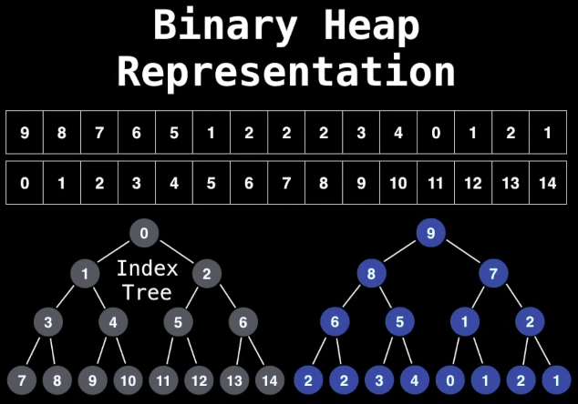

# Heap Data Structure
## 1. Introduction

- **<ins>Heap Data Structure</ins>**
  - A *Heap* is a ***Specialized Tree Based DS*** that satisfies the *heap invariant* (also called Heap property): If *A* is a parent node of *B* then *A* is ordered with respect to *B* for all nodes *A*, *B* in the heap.
  - It is commonly used to implement priority queues, as it efficiently supports the operations of finding and removing the highest (or lowest) priority element.
  - A Binary Heap is a Complete Binary Tree, which is typically represented as an array.
    - The root element will be at ***array[0]***.
    - The below table shows indices of other nodes for the ith node, i.e., ***array[i]***:

  |       Node      |  Logic (0 based index)  |  Logic (1 based index)  |
  | --------------- | ----------------------- | ----------------------- |
  | Get Parent Node | array[ (i - 1) / 2]     | TODO     |
  | Get Left Child  | array[ (2 * i) + 1]     | TODO     |
  | Get Right Child | array[ (2 * i) + 2]     | TODO     |

  - **Types of Heap**
    - ***Max Heap:***
      - The largest element is at root.
      - The value of Parent node is always greater than or equal to the value of child nodes.
    - ***Min Heap:***
      - The smallest element is at root.
      - The value of Parent node is always less than or equal to the value of child nodes.
    - ***Binary Heap:***
      - A common implementation of a heap using a complete binary tree structure, often represented as an array.
      - Every node has exactly 2 child nodes.
        - **Note: Binary Tree**
          - A Binary Tree Data Structure is a hierarchical data structure in which each node has at most two children, referred to as the left child and the right child. 
          - It is commonly used in computer science for efficient storage and retrieval of data, with various operations such as insertion, deletion, and traversal.
      - **Inserting new objects**
        - Compare the value with `root node` if the value is *smaller* traverse to the *left child* otherwie go tot the right child, repeating the process unitl we reach leaf node.
      - **Deleting new Objects**
        - In general with heaps we always want to remove the `root` value becauase it's the node of the interest with highest priority (either smallest or highest value).
        - **Array based implementation:**
          - **poll():** Removing a node from heap is called polling, which will remove the root node (first element in array based implementation.)
            - *Steps:* 
              - We first swap the root node with last node.
              - Delete the last node.
              - Now bubble down the root node to place the new root node to it's right location to satisfy the tree invariant properties.
              - Choose the node/leg with the smallest value while finding the position.
              - Time complexity - O(log N)
          - **Remove(20):** Delete the node with value `20`. 
            - *Steps:*
              - Perform linear scan to find the position of desired node lets say `x` index.
              - Now swap it (`x` index) with the last node (nth index) in the tree.
              - Now remove the last node.
              - Bubble up / down the `x` index to maintain tree property (min value on top) if required..
              - Time complexity - O(N)
              - **Note:**
                - The inefficiency of the removal algorithm comes from the fact that we have to perform a linear search to find out where an element is indexed at.
                  - What if we did a index lookup using a hash table to find out where a node is indexed at?
                  - As a Hashtable provides constant time lookup and update for a mapping from a key (the node value) to a value (the index).
    - ***Binomial Heap:***
      - A Binomial Heap is a collection of Binomial Trees. It's an extension of Binary Heap that p*rovides faster union or merge operation with other operations provided by Binary Heap*. 
      - It is a set of Binomial Trees where each Binomial Tree follows the Min Heap property and there can be at most one Binomial Tree of any degree.
        - **Note: Binomial tree**
          - A Binomial tree is not a balanced Tree or a Binary tree.
          - Some properties of Binomial Tree:
            - Let $ B_k $ is a Binomial tree with `k` order.
            - $ B_k $ has `k` child nodes at root.
            - $ B_k $ can be formed using 2 $ B_(k-1) $ trees.
            - The root of one $B_(k-1) $ will be the **leftmost child** of the root of other $ B_(k-1)$.
      - The main application of Binary Heap is to implement a priority queue.
    - ***Fibonacci Heap:***
      - x
    - ***Pairing Heap:***
      - x
  - **Key Characteristics:** 
    - ***Tree Structure:*** 
      - Heaps are typically implemented as binary trees (binary heaps), but they can also have other structures like *Fibonacci heaps* or *Binomial heaps*.
    - **Complete Binary Tree:** 
      - A tree in which at every level, except possibly the last is completely filled and all the nodes are as far as left possible.
        - This means data is compared from left child/node of the tree and and inserted at right position from left child/node. 
      - In a binary heap, the tree is always a complete binary tree, meaning all levels are fully filled except possibly the last, which is filled from left to right.
    - **Heap Property:**
      - ***Max-Heap:*** 
        - Parent nodes are always greater than or equal to their child nodes.
      - ***Min-Heap:*** 
        - Parent nodes are always less than or equal to their child nodes.
  - **Binary Heap representation in Array:**

  

  - **Operations on MinHeap:**
    - Below are some standard operations on min heap:
      - **getMin():** 
        - Returns the root element of **Min Heap**. 
        - The time Complexity of this operation is *O(1)*. 
        - *Note:* In case of a **Maxheap** it would be ***getMax()***.
      - **extractMin():** 
        - Removes the minimum element from **MinHeap**.
        - The time Complexity of this Operation is *O(log N)* as this operation needs to maintain the heap property *(by calling heapify())* after removing the root.
      - **decreaseKey():** 
        - Decreases the value of the key. The time complexity of this operation is *O(log N)*. 
        - If the decreased key value of a node is greater than the parent of the node, then we don’t need to do anything. 
          - Otherwise, we need to traverse up to fix the violated heap property.
      - **insert():**
        - Inserting a new key takes *O(log N)* time. 
        - We add a new key at the end of the tree. If the new key is greater than its parent, then we don’t need to do anything. 
          - Otherwise, we need to traverse up to fix the violated heap property.
      - **delete():** 
        - Deleting a key also takes *O(log N)* time. 
        - We replace the key to be deleted with the minimum infinite by calling *decreaseKey()*. 
          - After decreaseKey(), the minus infinite value must reach root, so we call *extractMin()* to remove the key.
- **Time Complexility**
 
|      MinHeap       |    T.C.   |      MaxHeap       |    T.C.   |
| ------------------ | --------- | ------------------ | --------- |
| Heap Construction  | O(n)      | Heap Construction  | O(n)      |
| getMin()           | O(1)      | getMax()           | O(1)      |
| extractMin()       | O(log N)  | extractMin()       | O(log N)  |
| decreaseKey()      | O(log N)  | decreaseKey()      | O(log N)  |
| insert()           | O(log N)  | insert()           | O(log N)  |
| delete()           | O(log N)  | delete()           | O(log N)  |
| polling()          | O(log N)  | polling()          | O(log N)  |
| removing()         | O(N)      | removing()         | O(N)      |

- **Applications of Heap DS**
  - *Priority Queues:* Efficiently manage tasks with varying priorities.
  - *Heap Sort:* A sorting algorithm with O(N log N) complexity.
  - *Graph Algorithms:* Like Dijkstra's and Prim's algorithms, which use heaps to find the shortest path or minimum spanning tree.
  - *Median Finding:* Maintain a max-heap and min-heap to find the median efficiently.

- **<ins>References:</ins>**
  - [https://youtu.be/RBSGKlAvoiM](https://youtu.be/RBSGKlAvoiM)
  - [Compete Binary Tree](https://www.geeksforgeeks.org/complete-binary-tree/)
  - [Binomial Heap](https://www.geeksforgeeks.org/binomial-heap-2/)
  - [Binomial Tree](https://www.youtube.com/watch?v=UqvGHUNd9Uw)
---

<h1> ------ End ------ </h1>

---
<!-- HTML styling -->
