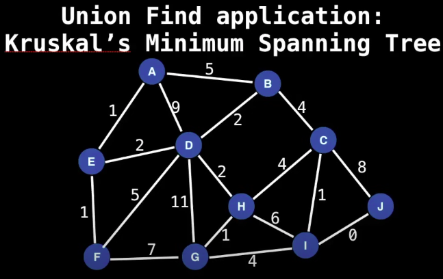
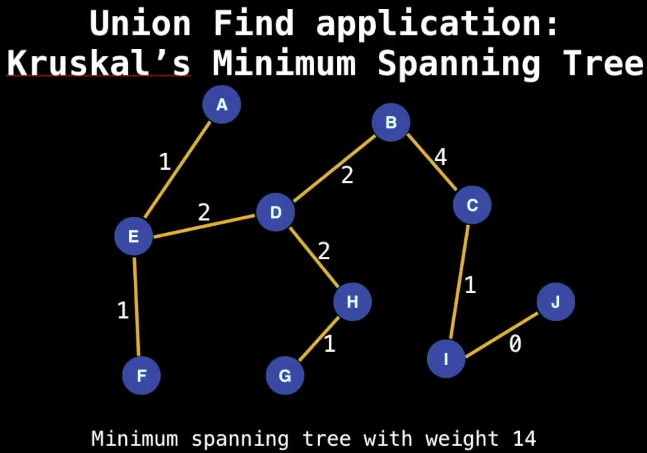

# Union-Find (Disjoint set or Merge-find set)
## 1. Introduction

- **<ins>Data Structure</ins>**
  - ***Union Find*** is a Data structure that keeps track of elements which are split into one or more disjoint sets, meaning it stores a collection of *disjoint(non-overlapping) sets*. Equivalently, it stores a partition of a set into disjoint subsets. 
  - It provides operations for adding new sets, merging sets (replacing them with their union), and finding a representative member of a set. The last operation makes it possible to determine efficiently whether any two elements belong to the same set or to different sets.
  - It has two primary operations: ***find*** & ***union***.

- **Use cases:**
  - Kruskal's minimum spanning tree algorithm
  - Grid Precolation
  - Network Connectivity
  - Least common ancestor in trees.
  - Image processing

  - **Kruskal's minimum spanning tree algorithm:**
    - It's a ***greedy algorithm*** used to find the ***Minimum Spanning Tree (MST)*** of a graph. An *MST* is a subset of the edges in a connected, weighted graph that connects all vertices without forming cycles and with the minimum possible total edge weight / count.
    - Given a $graph = (V,E)$ we want to find a *Minimum spanning tree* in the graph (it may not be unique).
    - Below images demonstrate the Kruskal's algorithm.
<center>
  
  
</center>

  - **Steps of Kruskal's Algorithm:**
    - *Sort Edges:*
      - Sort all the edges in the graph in non-decreasing order of their weights.
    - *Initialize Forest:*
      - Treat each vertex as an independent set (a "forest" of single nodes).
    - *Add Edges:*
      - Iteratively add edges from the sorted list to the MST.
      - Use the Union-Find/Disjoint-Set Data Structure to avoid cycles:
      - For each edge, check if the two vertices it connects belong to different sets.
        - If they are in different sets, add the edge to the MST and merge the two sets (union).
        - If they are in the same set, skip the edge (to avoid cycles).
    - *Stop Condition:*
      - Continue adding edges until the MST contains exactly $(V-1)$ edges, where $V$ is the number of vertices in the graph.
  - **Pseudocode:**
  ```sh
      KRUSKAL(graph):
      1. MST = []                  # Initialize an empty MST
      2. Sort all edges by weight
      3. Initialize a Disjoint-Set for all vertices
      4. For each edge (u, v) in sorted edge list:
          a. If u and v belong to different sets:
              i. Add edge (u, v) to MST
              ii. Union(u, v) in the Disjoint-Set
          b. If u and v are in the same set, skip edge
      5. Return MST
  ```
  - **Example:**
    - ***Graph Input:***
        - Vertices: ${A, B, C, D}$
        - Edges: ${ (A-B, 1), (B-C, 4), (A-C, 3), (C-D, 2), (B-D, 5) }$
    
    - **Steps:**
      1. ***Sort edges by weight:*** 
         - $[(A−B,1),(C−D,2),(A−C,3),(B−C,4),(B−D,5)]$.
      
      2. ***Initialize Disjoint-Set:***
          - Sets: ${A},{B},{C},{D}$.
      
      3. ***Process edges:***
         - Add $(A−B)$: No cycle, merge ${A},{B}$.
         - Add $(C−D)$: No cycle, merge ${C},{D}$.
         - Add $(A−C): No cycle, merge ${A,B},{C,D}$.
         - $(B−C)$: Skip (forms cycle).
         - $(B−D)$: Skip (forms cycle).

      4. ***Output:***
         - Edges: $[(A-B, 1), (C-D, 2), (A-C, 3)]$
         - Total Weight: $6$

- **Implementation:**
  - While there are several ways of implementing disjoint-set data structures, in practice they are often identified with a particular implementation known as a disjoint-set forest. 
    - This specialized type of forest performs union and find operations in near-constant amortized time. 
    - For a sequence of $m$ *addition, union, or find operations* on a disjoint-set forest with $n$ nodes, the total time required is $O(mα(n))$, where $α(n)$ is the *extremely slow-growing inverse Ackermann function*.
    - Although disjoint-set forests *do not guarantee* this time per operation, each operation rebalances the structure (via tree compression) so that subsequent operations become faster. As a result, disjoint-set forests are both asymptotically optimal and practically efficient.
  - Disjoint-set data structures play a key role in ***Kruskal's algorithm*** for finding the minimum spanning tree of a graph. 
    - The importance of minimum spanning trees means that disjoint-set data structures support a wide variety of algorithms.
    - In addition, these data structures find applications in symbolic computation and in compilers, especially for register allocation problems.

- **Time Complexity:**

|     Operation      |   T.C. |          Note           |
| ------------------ | ------ | ----------------------- |
| Construction       | $O(n)$ | Create new UnionFind DS |
| Union              | $a(n)$ | Merge two sets |
| Find               | $a(n)$ | Find the given element |
| Get Component Size | $a(n)$ | List of element in a set |
| Check if connected | $a(n)$ | True if two elements have same root node |
| Count Components   | $O(1)$ | Number of sets available |

>Note: $a(n)$ --> Amortized constatnt time, almost constatnt time although not contant time.

- **Operations:**
  - **Union & Find Operations**
    - ***Find Operation:***
      - To find which component a particular element belongs to find the root of that component by following the parent nodes until a self loop is reached (a node who's parent is itself).
    - ***Union Operation:***
      - To *Unify* two elements find which are the root nodes of the each component and if the root nodes are different make one of them root nodes be the parent of the other.
    - ***Creation:***
      - To begin with union find first construct a **bijection (a mapping)** between the objects and integers in the range of $[0, n)$ *($0$ inclusive to $n$ non-inclusive)*.
      - This mapping can be stored in *Hash table* for constant time lookup.
      - **Note:**
        - This step is not necessary in general but it will allow us to construct an array based union-find.
    - ***Path Compression:***
      - It's an optimization technique used in the disjoint-set data structure (also known as union-find) to improve the efficiency of the find operation. It helps keep the structure of the sets more compact, reducing the time complexity of future operations.
      - *How It Works:*
        - When performing the find operation to determine the root or representative of a set, path compression flattens the structure of the tree by making each node point directly to the root. This ensures that subsequent operations will require fewer steps.
      - *Algorithm:*
        - When you call find(x), the algorithm traverses from the node x to the root of the set.
        - While doing this, it updates each node on the path to point directly to the root. This way, the depth of the tree decreases, and future queries for these nodes will take constant time.
        - *Use Cases:*
          - Path compression in disjoint sets is commonly used in algorithms like:
            - Kruskal's Algorithm for Minimum Spanning Tree.
            - Connected Component Detection in a graph.
            - Various union-find problems in competitive programming.
  - **Note:**
    - In this data structure, we do not  ***un-union*** elements.
    - In general, this would be very inefficient to do since we would have to update all the children of a node.
    - The number of components in our *union-find* is going to be equal to the number of root nodes remaining. Because each root node is responsible for a component.
    - The number of root nodes never increases, instead it always decreases because of unifying the components.

- **Implementation:** *Github.com* [UnionFind.java](https://github.com/SRVivek1/grokking-coding-rounds/blob/main/a1-ds-algo-java/a1-ds-arrays/src/main/java/com/srvivek/dsalgo/disjointset/UnionFind.java)
  ```java
      /**
        * UnionFind / Disjoint Set data-structure implementation.
        */
        public class UnionFind {

            // The number of elements in the UnionFind.
            private int size;

            // Used to track the size of each of the component.
            private int[] compSize;

            /*
            * id[i] points to the parent of i,
            * if df[i] = i then i is the root node.
            */
            private int[] id;

            // Tracks the number of components in the UnionFind
            private int numComponents;

            /**
             * Initializes UnionFind DS with given size.
            *
            * @param size
            */
            public UnionFind(int size) {

                if (size <= 0) throw new IllegalArgumentException("size <= 0 not allowed.");

                this.size = this.numComponents = size;
                compSize = new int[size];
                id = new int[size];

                for (int i = 0; i < size; i++) {
                    id[i] = i; // Link to itself (self node)
                    compSize[i] = 1; // Each component is originally of size 1
                }
            }

            /**
             * Find which component/set 'p' belongs to, takes amortized constant time.
            *
            * @param p
            * @return
            */
            public int find(int p) {
                int root = p;
                // find root node of the component/set
                while (root != id[root]) {
                    root = id[root];
                }

                /*
                * Compress the path leading back to the root node.
                * This operation is called 'Path compression'
                * and this is how 'amortized time complexity' is achieved.
                */
                while (p != root) {
                    int next = id[p];
                    id[p] = root;
                    p = next;
                }
                return root;
            }

            /**
             * Returns true if 'p' and 'q' are part of same component / set,
            * that is they have same root node.
            *
            * @param p
            * @param q
            * @return
            */
            public boolean connected(int p, int q) {
                return find(p) == find(q);
            }

            /**
             * Returns the size of the component/set 'p' belongs to.
            * Note: Root nodes will be having the size of component/size.
            *
            * @return
            */
            public int componentSize(int p) {
                return compSize[find(p)];
            }

            /**
             * Returns the number of elements in this UnionFind/Disjoint Set.
            *
            * @return
            */
            public int size() {
                return size;
            }

            /**
             * Returns the number of remaining components/sets.
            *
            * @return
            */
            public int components() {
                return numComponents;
            }

            /**
             * Merge two disjoint set/components together.
            *
            * @param p
            * @param q
            */
            public void unify(int p, int q) {

                int root1 = find(p);
                int root2 = find(q);

                // The elements are already in same group.
                if (root1 == root2) {
                    return;
                }

                /*
                * Merge two components / sets together
                * Approach:
                *  --> Merge smaller set into the larger one by checking the component size of set.
                */
                if (compSize[root1] < compSize[root2]) {
                    compSize[root2] += compSize[root1];
                    // root2 is parent of root1
                    id[root1] = root2;
                } else {
                    compSize[root1] += compSize[root2];
                    id[root2] = root1;
                }

                // reduce components/set count as we are merging two sets.
                numComponents--;
            }
        }
  ```

- **<ins>References:</ins>**
  - [https://youtu.be/RBSGKlAvoiM?t=8913](https://youtu.be/RBSGKlAvoiM?t=8913)
---
<center>
<h1> ------ End ------ </h1>
</center>

---
<!-- HTML styling -->
<style>
table, th, td {
  border: 1px solid black;
  border-collapse: collapse;
}
</style>